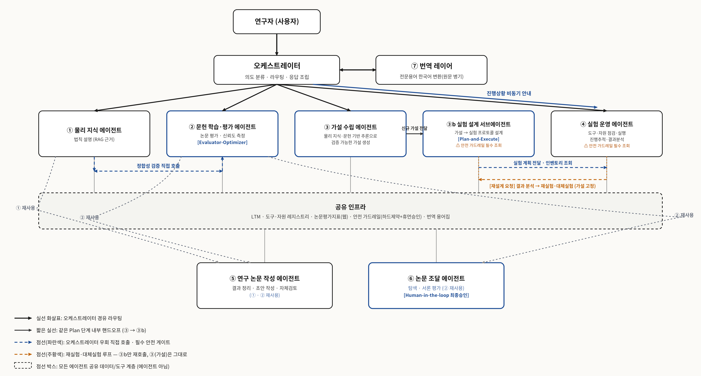

# Science Chatbot — 물리 연구 어시스턴트

실험을 보조하고, 논문을 검색·학습해 지식을 안내하는 과학 챗봇. 최종 목표는 오케스트레이터가 전문 에이전트들을 라우팅하는 **멀티 에이전트 물리 연구 어시스턴트**이며, 현재는 그 첫 구성 요소인 **Self-RAG 스타일 단일 에이전트**(물리 지식 에이전트)가 동작한다.

## 목표 아키텍처



| 에이전트 | 역할 | 핵심 기법 |
|---|---|---|
| 오케스트레이터 | 의도 분류·라우팅·응답 조립 | Supervisor 패턴 |
| 물리 지식 | 물리 법칙 설명 | RAG ← **현재 구현** |
| 문헌 학습·평가 | 논문 요약·신뢰도 평가 → 장기기억 승격 | Evaluator-Optimizer |
| 가설 수립 | 검증 가능한 가설 생성 | - |
| 실험 설계 (서브) | 가설 → 실험 프로토콜 (변수·통제조건·장비) | Plan-and-Execute |
| 실험 운영 | 도구·자원 점검, 진행 추적, 결과 분석 → 재설계 요청 | - |
| 논문 작성 | 결과 종합, 초안 작성 | - |
| 논문 조달 | 논문 탐색·트리아지, 구매는 사람이 결정 | Human-in-the-loop |
| 번역 레이어 | 응답 직전 한국어 후처리 (원문 병기) | - |

설계 원칙: 실험 안전은 공유 가드레일이 계획·실행 양 단계에서 검사하고 임계치 초과 시 사람 승인 전까지 진행 불가. 멀티 에이전트 전환은 재작성이 아니라 현재 그래프를 서브그래프로 포장하는 방식.

## 현재 구현 — Self-RAG 에이전트

```
START → retrieve → generate ──(tool 요청)──→ run_tools ──→ generate (ReAct 루프)
             ↑          └─(답변 완성)→ verify ──── 통과 ────→ final_answer → END
             │                          ├── 수정 필요 → generate (재시도)
             └──────────────────────────┘── 컨텍스트 부족 → retrieve (top_k+1)
```

- **retrieve**: 벡터 검색 (기본 top_k=3). 재검색 시 벡터DB 문서는 교체하되 tool로 수집한 증거는 보존
- **generate**: 대화 이력(`add_messages` reducer) 기반 답변 생성. tool이 필요하면 `tool_calls`만 요청 — 실행은 run_tools 노드 담당. 재시도 시 verify의 지적사항을 대화 메시지로 반영
- **run_tools**: tool 실행 + 예외처리. 모든 tool_call에 반드시 ToolMessage로 응답(실패 포함) → LLM이 다음 라운드에 에러를 읽고 자가수정. 빈 결과·호출 실패·미등록 tool을 구분해 다른 힌트 제공, **연속 2회 실패한 tool은 해당 런에서 자동 제외(서킷 브레이커)**. 성공 결과는 Document로 변환해 RAG context에 병합
- **verify**: 구조화 출력(`fix_needed`, `what_to_fix`, `needs_more_context`)으로 답변 검증. **생성 모델과 다른 모델이 검증** (교차 검증) — generate가 fallback으로 갈아탄 경우에도 실제 생성 모델(`generated_by`)을 기준으로 회피하며, 가용 모델이 하나도 안 남으면 차순위로 생성자 본인이 검증
- **route_by_fix**: 3방향 분기. `try_count >= limit` 시 강제 종료 + 실패 사유 명시
- **State**: Pydantic 모델 — 필드 기본값·타입 검증, `messages`는 `add_messages` reducer로 자동 누적

### 특징

- **모델 선택 + fallback 체인**: `model_map`(gemini-2.5-flash / claude-haiku / **Qwen-tuned**)에서 요청별 선택, rate limit·접속 오류 시 남은 모델로 자동 전환. 실패한 모델은 `disabled_models`로 State에 기록되어 같은 요청 안에서는 재시도하지 않음 (노드를 넘나드는 모델 서킷 브레이커). 회피 대상(`models_skip`, 요청마다 새로 정함)과 고장 목록(`disabled_models`, 실패 시 누적)을 별도 파라미터로 분리 — 합쳐서 관리하면 "이번엔 피하고 싶을 뿐"과 "완전히 죽었음"이 뒤섞여 생성자 자신이 영구 배제될 수 있음.

2개 모델이 동시에 장애여도 3번째로 정상 응답 — 상세 로그: [docs/README_09.md](docs/README_09.md#장애-복원력-테스트)
- **자체 파인튜닝 모델 연동**: Qwen2.5-1.5B를 물리 QA로 QLoRA 파인튜닝 → Q4_K_M GGUF → 로컬 llama-server(OpenAI 호환)로 서빙 ([docs/README_09.md](docs/README_09.md) 참고)
- **로컬 임베딩** (BAAI/bge-m3): 임베딩에 API rate limit·비용 없음, 검색 시 외부 의존 없음
- **LangSmith tracing** + LLM-as-judge 평가 (아래 [평가](#평가) 참고)

## 파일 구조

```
Science_Chatbot/
├── docs/
│   ├── architecture.png     # 목표 아키텍처 다이어그램
│   ├── feynman.txt          # 코퍼스: The Feynman Lectures on Physics
│   ├── README_08.md         # 개발 회고 (8주차: LangGraph 에이전트)
│   ├── README_09.md         # 개발 회고 (9주차: QLoRA 파인튜닝·양자화·GGUF)
│   └── train_qa.json        # 파인튜닝 학습 데이터 45문항 (파인만 강의록 기반)
├── evaluation/
│   ├── eval.json             # 평가 데이터셋 31문항 (질문/정답/카테고리/난이도/unsolved)
│   ├── eval.md               # eval.json에서 자동 생성되는 카테고리별 표
│   ├── generate_eval_md.py   # eval.json → eval.md 생성 스크립트
│   ├── evaluate.py           # LLM-as-judge 평가 (--target으로 평가 대상 선택)
│   ├── eval_avg.py           # results/의 실행별 평균 점수 요약
│   └── results/               # evaluate.py 실행 결과 (모델별 JSON)
├── models/               # GGUF 모델 가중치 (git 제외)
├── chroma_db/            # ChromaDB 영구 저장소
├── graph.py              # LangGraph StateGraph — 에이전트 본체 (State, 노드, 배선)
├── models.py             # model_map + invoke_with_fallback (모델 등록·fallback 정책의 단일 지점)
├── tool.py               # tool 레지스트리 (검색 tool 팩토리, tools_list, tool_map)
├── retrieval.py          # 임베딩 + 벡터스토어 (ingest와 공유 — 임베딩 모델 불일치를 구조로 방지)
├── ingest.py             # 인덱싱: 청킹 → 로컬 임베딩 → ChromaDB
├── main.py               # FastAPI: POST /query
└── .env                  # API 키 (git 제외)
```

## 사전 준비

| 도구 | 용도 | 설치 |
|---|---|---|
| [uv](https://docs.astral.sh/uv/) | 파이썬 버전·패키지 관리 (필수) | `brew install uv` 또는 `curl -LsSf https://astral.sh/uv/install.sh \| sh` |
| [llama.cpp](https://github.com/ggml-org/llama.cpp) | 자체 모델(GGUF) 로컬 서빙 — `Qwen-tuned` 사용 시에만 | `brew install llama.cpp` |

Python은 따로 설치하지 않아도 된다 — `uv sync`가 `pyproject.toml`의 `requires-python`에 맞는 버전을 자동으로 받아온다. 파이썬 패키지 의존성 전체는 `pyproject.toml`에 선언되어 있고 `uv sync` 한 번으로 설치된다. API 키는 아래 [환경변수](#환경변수-env) 참고.

## 실행

```bash
# 의존성 설치
uv sync

# 인덱싱 (최초 1회)
uv run ingest.py

# 서버
uv run fastapi dev main.py

# 단독 실행 (터미널 테스트)
uv run graph.py

# (선택) 자체 파인튜닝 모델 서빙 — model: "Qwen-tuned" 사용 시 필요
llama-server -m models/qwen_finetuned_Q4_K_M.gguf --port 8080
```

> **GGUF 참고**: 모델 가중치(941MB)는 용량 문제로 저장소에 포함되지 않는다 (`models/`는 git 제외). `Qwen-tuned` 없이도 gemini/claude로 모든 기능이 동작하며, 파인튜닝 과정은 [docs/README_09.md](docs/README_09.md)에 기록되어 있다.

> **임베딩 모델 참고**: `BAAI/bge-m3`는 별도 설치가 필요 없다 — 첫 실행 시 Hugging Face Hub에서 자동 다운로드된다 (약 2GB, `~/.cache/huggingface`에 캐시). 이후 실행은 캐시를 사용하므로 빠르며, API 키·네트워크 없이 로컬에서 동작한다. 단 `ingest.py`와 `graph.py`는 반드시 같은 임베딩 모델을 써야 한다 (모델이 다르면 벡터 공간이 달라져 유사도 검색이 무의미해짐).

## API

```
POST /query
{
  "prompt": "파인만이 설명한 원자가 뭐야?",
  "top_k": 3,
  "limit": 4,
  "model": "gemini"
}

→ {"answer": "..."}
```

- `model`: `"gemini"` (기본값) / `"claude"` / `"Qwen-tuned"` (로컬 llama-server 필요)
- `top_k`: 검색 문서 수 (기본값 3)
- `limit`: 최대 verify 루프 횟수 (기본값 4)

## 평가

`evaluation/eval.json` 31문항(7개 물리 카테고리 + 미해결 문제)을 LLM-as-judge로 채점한다. 채점자는 claude-haiku로 **전 실행에서 동일하게 고정** — 채점자가 바뀌면 실행 간 비교가 오염되기 때문. 미해결(unsolved) 문항은 "미해결임을 인정하는가 + 언급한 사실이 정확한가"를 별도 기준으로 채점한다.

```bash
uv run evaluation/evaluate.py --target gemini                              # 모델 단독 (bare)
uv run evaluation/evaluate.py --target claude
uv run evaluation/evaluate.py --target Qwen-tuned --name qwen-tuned-q4     # llama-server 필요
uv run evaluation/evaluate.py --target graph                               # RAG+verify 전체 파이프라인
```

- `--target`: 평가 대상. bare 모델끼리는 모델 역량 비교, graph vs bare는 파이프라인 기여도 비교
- `--name`: 결과 저장 이름 (기본값 target) — 같은 모델의 변형(양자화 전/후 등) 구분용
- 결과는 `evaluation/results/eval_{name}.json`에 저장되어 실행 간 비교 가능
- `uv run evaluation/eval_avg.py`: `evaluation/results/`의 모든 실행 파일별 평균 점수를 한눈에 비교

## 환경변수 (.env)

```
GOOGLE_API_KEY=...
ANTHROPIC_API_KEY=...
LANGSMITH_API_KEY=...   # 선택: tracing·평가용
```

## 로드맵

- [x] Pydantic State 전환 + `messages`(add_messages) 필드 — 기반 리팩토링
- [x] tool 노드 분리 (ReAct 표준 구조) + tool 예외처리·서킷 브레이커
- [x] 모듈 분리 (models / tool / retrieval)
- [x] 개인 언어 모델: Qwen2.5-1.5B QLoRA 파인튜닝 → PTQ → GGUF → llama.cpp 로컬 서빙 → `model_map` 등록, max_token, frequency_penalty 설정
- [ ] 모델 비교 평가 완주 (bare 3종 + graph 구성별) 및 비교 리포트
- [ ] 단기기억 + 쓰레드 (checkpointer, thread_id별 세션)
- [ ] `interrupt_before`로 human-in-the-loop
- [ ] 프론트엔드 (Streamlit)
- [ ] 멀티 에이전트 전환: 현 그래프를 물리 지식 에이전트로 포장 → 오케스트레이터 → 문헌·조달·가설·실험 설계·번역 레이어
- [ ] 장기기억 유저별 분리 (VDB 메타데이터 필터링)
- [ ] 실험: verify 구성 비교 (self / 교차 / 무 verify / 다중 모델 앙상블 — correctness·토큰·지연 지표)

## 데이터 & 감사

- 코퍼스: [The Feynman Lectures on Physics](https://www.feynmanlectures.caltech.edu/) — Caltech이 무료 공개한 파인만의 물리학 강의록
- Thank you to arXiv for use of its open access interoperability.

## 사용 라이브러리

- `langgraph` — StateGraph, 조건 분기, (예정) checkpointer·interrupt
- `langchain-google-genai` / `langchain-anthropic` — LLM
- `langchain-openai` — 로컬 llama-server 연결 (OpenAI 호환 클라이언트)
- `langchain-huggingface` — 로컬 임베딩 (bge-m3)
- `langchain-chroma` — 벡터 저장소
- `langchain-community` + `ddgs` — 웹 검색 tool
- `pydantic` — 구조화 출력·State 스키마
- `fastapi` + `uvicorn` — REST API
- `langsmith` — tracing·평가
