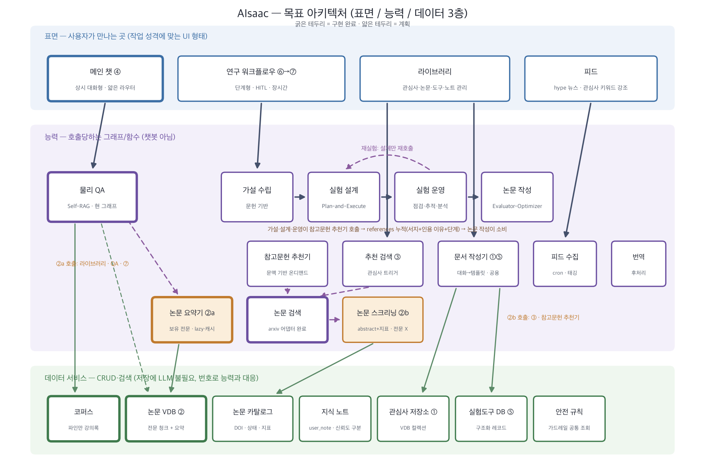

# AIsaac — 과학 연구 어시스턴트

> 골방의 질문을 논문으로 — 아이디어의 궤도를 끝까지 함께 돈다.

과학 연구를 돕는 개인용 AI 어시스턴트. 내려받아 자기 컴퓨터에서 실행한다.

- **묻고 답하기** — 과학·수학 질문에 등록해둔 자료와 웹 검색을 근거로 답한다
- **논문 관리** — PDF나 DOI·arXiv 번호로 논문을 등록하면 핵심 주장·근거·한계를 자동으로 뽑아 정리해주고, 관심사를 등록해두면 관련 논문을 찾아 추천한다
- **연구 진행** — 가설 수립 → 실험 설계 → 실험 운영 → 보고서 → 논문 초안까지 단계별로 함께 진행한다

## 내려받아 쓰기

### 방법 A — 터미널 한 줄 (Mac·Linux, 권장)

**보안 경고가 뜨지 않고 설치 위치도 알아서 정해진다.** 아래 한 줄을 터미널에 붙여넣으면
된다(어느 폴더에서 실행하든 `~/AIsaac`에 설치된다).

```bash
curl -fsSL https://raw.githubusercontent.com/Quart512/AIsaac/main/scripts/install.sh | bash
```

> **왜 이게 더 간단한가** — macOS의 "확인되지 않은 개발자" 경고는 **브라우저가 파일에
> 붙이는 표시** 때문에 생긴다. `curl`은 그 표시를 안 붙이므로 경고 자체가 안 뜨고,
> 시스템 설정을 오갈 일도 없다. 이미 설치돼 있으면 논문·노트·대화 기록·받아둔 모델을
> 그대로 두고 앱만 새 버전으로 바꾼다.
>
> 실행되는 내용이 궁금하면 [scripts/install.sh](scripts/install.sh)를 먼저 읽어봐도 된다.

### 방법 B — 파일 직접 받기

설치 프로그램이 없다. **압축을 풀고 실행 파일을 더블클릭하면 끝**이다. 다만 이 방법은
macOS·Windows 둘 다 보안 경고를 넘기는 절차가 필요하다(아래 3번 참고).

#### 1. 내 운영체제에 맞는 파일 받기

[**최신 버전 다운로드 →**](https://github.com/Quart512/AIsaac/releases/latest)

| 내 컴퓨터 | 받을 파일 | 압축 푼 뒤 실행할 것 |
|---|---|---|
| **Mac (M1 이상)** | `AIsaac-macos.zip` | `AIsaac.app` |
| **Windows** (64비트) | `AIsaac-windows.zip` | `AIsaac.vbs` |
| **Linux** (64비트) | `AIsaac-linux.zip` | `AIsaac.desktop` (안 되면 `./run.sh`) |
| **Intel Mac** · 그 외 | `AIsaac-docker.zip` | `start.command` / `start.bat` |

> **Intel Mac은 맨 아래 Docker판을 받아야 한다.** 일반 Mac판은 Apple Silicon 전용이다 —
> 내부적으로 쓰는 라이브러리가 Intel Mac용 배포본을 더 이상 만들지 않아 생긴 제약이라
> 우회할 방법이 없다. Docker판은 [Docker Desktop](https://www.docker.com/products/docker-desktop)이
> 미리 설치돼 있어야 하고, 종료할 때 `stop.command`/`stop.bat`을 꼭 눌러야 한다
> (창만 닫으면 컨테이너가 계속 떠 있다).

#### 2. 첫 실행

- **앱 창은 바로 열리지만, 처음 한 번은 검색에 쓰는 AI 모델(약 2GB)을 내려받는다.**
  진행률이 화면 아래에 표시되고, 다 받을 때까지 질문·검색은 응답을 기다린다. 그동안
  설정 화면에서 API 키를 넣어두면 된다. 두 번째부터는 이 과정이 없다.
- **macOS 사용자 주의**: 압축 푼 `AIsaac` 폴더를 **바탕화면·문서·다운로드 폴더 안에 두지 말 것.**
  macOS 보안 정책 때문에 그 세 폴더 밑에서는 첫 실행이 멈추거나 실패할 수 있다.
  사용자 홈 폴더 바로 밑처럼 다른 곳으로 옮긴 뒤 실행한다.
- 종료는 **열린 앱 창을 닫으면** 된다(서버도 같이 꺼진다). Docker판만 예외로 `stop` 스크립트를 쓴다.
- 실행하면 macOS·Windows 둘 다 보안 경고가 뜬다 — 정상이다. 넘기는 방법은 바로 아래.

#### 3. 처음 실행할 때 뜨는 보안 경고 넘기기

> 방법 A(터미널 한 줄)로 설치했다면 이 절은 건너뛰어도 된다 — 경고가 뜨지 않는다.

서명되지 않은 배포판이라(코드 서명 인증서는 유료라 아직 못 붙였다) macOS·Windows 둘 다
"출처를 알 수 없는 프로그램"이라는 경고를 띄운다. **한 번만 허용하면 다음부터는 경고 없이 바로 실행된다.**

##### macOS

1. `AIsaac.app`을 더블클릭하면 "Apple은 AIsaac에 악성 코드가 없는지 확인할 수 없습니다"라는
   경고가 뜨고 실행이 막힌다 — **완료**를 눌러 닫는다.
2. **시스템 설정 → 개인정보 보호 및 보안**으로 들어가 아래로 스크롤하면 **보안** 항목에
   "AIsaac의 사용이 차단되었습니다"라는 문구와 **그래도 열기** 버튼이 보인다 — 누른다.
3. 확인 대화상자가 한 번 더 뜨면 **열기**를 누른다(비밀번호나 Touch ID를 요구할 수 있다).

> 예전에는 앱을 우클릭(Control+클릭) → 열기로도 넘길 수 있었지만, **macOS Sequoia부터
> 이 방법이 막혔다** — 위 시스템 설정 경로만 된다.

4. 이어서 **"'applet'에서 'Google Chrome'을 제어하려고 합니다"**라는 창이 한 번 뜨면 —
   **허용**을 누른다. 앱 화면을 브라우저 창으로 띄우고, 그 창을 닫았을 때 서버도 같이
   끄기 위해 필요한 권한이다. 거부하면 창을 닫아도 서버가 계속 남는다.

> **왜 `.app` 승인 한 번으로 끝나는가** — 압축을 풀면 `runtime/` 밑 라이브러리 파일
> 수백 개에도 "인터넷에서 받음" 표시가 똑같이 붙는데, 위 **그래도 열기**는 `AIsaac.app`
> 하나만 승인하는 것이라 나머지가 실행 도중 하나씩 따로 차단된다(`library load
> disallowed by system policy`). 그래서 AIsaac은 **실행될 때 자기 폴더 안의 그 표시를
> 스스로 지운다** — 파일을 지우거나 바꾸지 않고, 범위는 `AIsaac` 폴더 안뿐이다.
> 예전 안내에 있던 `xattr -cr AIsaac.app`은 `.app` 안만 훑어서 정작 문제가 되는
> `runtime/`을 못 건드렸다 — 더 이상 직접 실행할 필요 없다.

##### Windows

1. 브라우저가 "이 파일은 다운로드하는 경우가 거의 없어 위험할 수 있습니다" 같은 경고를
   띄우면 → **유지**(또는 **계속**)를 누른다.
2. `AIsaac.vbs`를 더블클릭했을 때 파란 창("Windows에서 PC를 보호했습니다")이 뜨면 →
   **추가 정보**를 누른 뒤 **실행** 버튼을 누른다.

> **백신이 실행 파일을 격리·삭제하는 경우** — 특히 국내에서 많이 쓰는 백신(알약 등)은
> 서명 안 된 실행 파일에 더 민감하게 반응할 수 있다. Windows 보안(Defender)이라면
> **바이러스 및 위협 방지 → 보호 기록**에서 격리된 항목을 복원·허용하면 되고, 다른
> 백신은 그 프로그램의 예외(제외) 목록에 `AIsaac` 폴더를 추가한다.

##### Linux

`AIsaac.desktop`을 더블클릭했는데 아무 반응이 없거나 "신뢰할 수 없는 실행 파일"이라는
안내가 뜨면, 파일 관리자에서 **속성 → 실행 허용**(또는 우클릭 메뉴의 "실행 허용")을
체크한다. 그래도 안 되면 터미널에서 `AIsaac` 폴더로 이동해 `./run.sh`를 직접 실행한다.

### API 키 넣기

AI 모델은 **본인 API 키**로 돌아간다(서버 비용이 없는 대신 키는 직접 준비해야 한다).
앱을 켠 뒤 **설정** 화면에서 넣으면 되고, 키는 그 컴퓨터에만 저장된다.

| 키 | 용도 |
|---|---|
| Google Gemini | 기본 모델 |
| Anthropic Claude | 선택 — 답변 검증 단계에서 교차 확인용 |

### 그다음은

화면별로 무엇을 누르면 무엇이 되는지는 **[사용법 가이드](docs/USAGE.md)**에 정리돼 있다.
앱 안의 챗봇에게 "관심사 어떻게 등록해?"처럼 물어봐도 같은 내용을 안내해준다.

**내 데이터는 전부 내 컴퓨터에만 남는다** — 논문·노트·대화 기록은 앱 폴더 안
`data/`·`chroma_db/`에 저장되고, 외부로 보내지 않는다. 다른 기기로 옮기려면
설정 화면의 내보내기/가져오기를 쓴다.

## 문서 안내

읽는 사람 기준으로 나눠 뒀다.

| 문서 | 누가 보나 | 담는 내용 |
|---|---|---|
| **README.md** (이 문서) | 앱을 쓰려는 사람 | 무엇을 하는 앱인가, 받아서 실행하는 법, 구조 개요 |
| **[docs/USAGE.md](docs/USAGE.md)** | 앱을 쓰려는 사람 | 화면별 사용법 — 무엇을 누르면 무엇이 되는가 |
| **[docs/DEVELOPMENT.md](docs/DEVELOPMENT.md)** | 코드를 고치려는 사람 | 소스에서 실행하는 법, 파일 구조, API 레퍼런스, 테스트·평가 |
| **[docs/OPERATIONS.md](docs/OPERATIONS.md)** | 저자(배포 담당) | 번들 빌드, 릴리즈 내기, GitHub Actions, 랜딩 페이지 운영 |
| **[docs/RoadMap.md](docs/RoadMap.md)** | 개발 이력이 궁금한 사람 | 날짜별 완료·예정 + 설계 노트 — **"왜 이렇게 됐는지"의 정본** |
| **docs/README_08~13.md** | 〃 | 주차별 개발 회고(아카이브) — 겪은 문제와 버린 대안 위주 |

> 이 README는 **"지금 무엇이 있고 어떻게 쓰는가"**만 다룬다. 왜 그렇게 됐는지(버린 대안,
> 겪은 문제)는 RoadMap과 주차별 회고에 있다.

## 구조

**화면(표면) / 기능(능력) / 저장소** 3층으로 나뉜다.



> 그림은 `uv run docs/draw_architecture.py`로 다시 만든다 (`docs/draw_architecture.py`의 박스 정의만 고치면 된다).

핵심 원칙: **챗봇을 여러 개로 쪼개지 않고, 작업 성격에 맞는 화면을 준다** — 대화는 챗, 등록·조회는 폼, 연구는 단계형 워크플로우. 상시 대화하는 챗봇은 메인 챗 하나뿐이고 나머지는 버튼·폼을 눌렀을 때 호출되는 기능으로 존재한다.

### 화면 — 사용자가 만나는 곳

| 화면 | 형태 | 내용 |
|---|---|---|
| 메인 챗 | 상시 대화형 | 과학·수학 등 궁금한 것을 물어보면 라이브러리에 등록해둔 자료와 웹을 검색해 답해준다 |
| 연구 워크플로우 | 단계형 (다음 단계로의 전환은 사용자가 직접 누름) | 연구 주제 하나를 정하면 가설 수립 → 실험 설계 → 실험 운영 → 실험 보고서 → 논문 초안까지 단계별로 이어서 진행하는 화면. 진행 상황이 그대로 남아 있어 이전 단계로 돌아가 다시 볼 수도 있다 |
| 라이브러리 | 관리 UI (탭) | 관심사·논문·실험도구·지식 노트를 등록·조회·관리하는 화면. 관심사를 등록하면 관련 논문을 찾아 추천해주고, 논문은 PDF나 DOI·arXiv 번호로 등록하면 자동으로 핵심을 뽑아 정리해준다 |

> 피드(관심 분야 최신 소식을 모아 보여주는 화면)는 아직 없다.

### 기능 — 화면 뒤에서 실제 일을 하는 것들

메인 챗 안에서, 또는 라이브러리·연구 워크플로우 화면의 버튼·폼을 눌렀을 때 호출돼 일을 하고 끝나는 기능들이다.

| 기능 | 무엇을 해주는가 | 어디서 만나는가 |
|---|---|---|
| 과학 Q&A | 과학 질문에 답한다. 답변에 어떤 자료를 근거로 삼았는지 같이 보여주고, 스스로 답을 점검해 부족하면 더 찾아보고 고쳐 쓴다 | 메인 챗 |
| 논문 추출기 | 라이브러리에 등록한 논문을 자동으로 읽고 핵심 주장·근거·저자가 스스로 밝힌 한계와 아직 안 풀린 문제를 정리해 보여준다. 논문을 평가하지는 않는다 — 저자가 쓴 내용을 그대로 뽑아 보여줄 뿐이다 | 라이브러리 논문 탭, 메인 챗(관련 논문이 있으면 참고 자료로 함께 인용) |
| 논문 스크리닝 | 검색된 논문 중 등록해둔 관심사와 실제로 관련 있는 것만 골라준다. 심사받은 학술지인지·인용 수·발표 연도도 같이 보여주되 하나의 점수로 합치진 않는다 — 최종 판단은 사용자 몫이다 | 추천 검색·참고문헌 추천기 뒤에서 자동으로 함께 동작 |
| 논문 검색 | 관심 주제와 관련된 논문을 인터넷(arXiv 등)에서 찾아온다 | 추천 검색·참고문헌 추천기 뒤에서 자동으로 함께 동작 |
| 문서 작성기 | 챗에서 나눈 대화를 바탕으로 관심사·실험도구 등록 폼을 미리 채워준다. 확인하고 저장 버튼만 누르면 된다 | 라이브러리의 "이 대화를 관심사로 등록" 같은 버튼 |
| 가설 수립 | 연구하고 싶은 주제를 알려주면 검증할 수 있는 형태의 가설과 그 근거를 세워준다 | 연구 워크플로우 |
| 실험 설계 | 세운 가설을 실제로 확인할 수 있는 실험 절차(무엇을 바꾸고 무엇을 측정할지, 어떤 장비가 필요한지)를 짜준다 | 연구 워크플로우 |
| 실험 운영 | 실제로 진행한 실험 결과를 입력하면 가설이 맞았는지, 실험 자체에 문제가 있었는지, 다시 해봐야 하는지를 판단해준다. 실험은 사람이 직접 하고 이 기능은 결과 해석만 한다 | 연구 워크플로우 |
| 논문 작성 | 가설 수립부터 실험 운영까지의 과정과 모아둔 참고문헌을 종합해 논문 초안(제목·초록·서론·방법·결과·고찰)을 써준다 | 연구 워크플로우 |
| 참고문헌 추천기 | 지금 보고 있는 글(논문 초안 문단, QA 답변 등)과 관련된 논문을 찾아 인용할 만한 후보로 추천해준다 | 연구 워크플로우 각 단계에서 자동으로 함께 동작 |
| 추천 검색 | 등록해둔 관심사를 기준으로 논문을 찾아 추천 목록에 올려준다. 자동으로 도는 게 아니라 "검색" 버튼을 눌렀을 때만 동작한다 | 라이브러리 관심사 탭 |
| 피드 수집 (아직 없음) | 관심 주제와 무관하게 요즘 화제가 되는 논문·소식을 모아 보여준다 | — |
| 번역 레이어 (아직 없음) | 답변을 자연스러운 한국어로 한 번 더 다듬어준다 | — |

### 데이터 저장 — 무엇이 어디에 남는가

| 저장소 | 내용 |
|---|---|
| 관심사 저장소 | 등록한 관심사(찾는 것·이미 아는 것·제외할 주제) |
| 논문 저장소 | 등록한 논문의 원문·추출 결과·서지정보(제목·저자·연도)·상태(추천/보유/기각) |
| 지식 노트 | 사용자가 쓴 노트 |
| 실험도구 목록 | 등록한 실험 장비 사양과 주의사항 |
| 코퍼스 | The Feynman Lectures on Physics |

> 설계 판단(왜 이렇게 나눴는지, VDB/RDB 선택 근거 등)은 이 문서가 아니라 [docs/RoadMap.md](docs/RoadMap.md)의 설계 노트에 정리돼 있다.

## 기술적으로 어떻게 동작하는가 (개발자용)

과학 Q&A는 한 번에 답하고 끝나지 않는다 — 관련 자료를 검색하고, 답을 쓰고, 스스로 검증해서 부족하면 다시 검색하거나 고쳐 쓰는 과정을 거친다. 논문 등록도 등록(파싱해서 검색 가능하게 만들기)과 추출을 분리해뒀다 — 추출은 실제로 필요할 때(라이브러리에서 펼쳐볼 때, QA가 참고할 때) 그 자리에서 하고 캐시해둔다.

소스에서 직접 실행하는 법·파일 구조·API 레퍼런스는 [docs/DEVELOPMENT.md](docs/DEVELOPMENT.md)에 있고,
각 설계 판단의 근거는 [docs/RoadMap.md](docs/RoadMap.md)(설계 노트)와 주차별 회고(`docs/README_08.md` ~ `README_13.md`)에 정리돼 있다.

## 개발 이력 · 로드맵

지금까지의 진행 과정과 앞으로의 계획은 별도 문서에 정리되어 있다:

- **[docs/RoadMap.md](docs/RoadMap.md)** — 날짜별 개발 이력(완료), 라이브 검증 체크리스트, 예정 전체. 설계 노트·열린 질문·방향성 메모 포함
- **주차별 회고** — [README_08](docs/README_08.md)(LangGraph 에이전트) · [README_09](docs/README_09.md)(QLoRA 파인튜닝·평가) · [README_10](docs/README_10.md)(서버 관찰) · [README_11](docs/README_11.md)(Docker·EC2·CI/CD) · [README_12](docs/README_12.md)(CI/프론트엔드 정비·아키텍처 개편·논문 추출기 완성) · [README_13](docs/README_13.md)(라이브러리 표면 1차·실험도구·연구 워크플로우·EC2 배포 트랙 폐지)

> **기능이 왜 지금 모습이 됐는지**(초기 구상에서 바뀐 것, 버린 대안, 겪은 문제)는 이 README가 아니라 위 두 곳에 있다. 이 문서는 "지금 무엇이 있고 어떻게 쓰는가"만 다룬다.

## 데이터 & 감사

- 코퍼스: [The Feynman Lectures on Physics](https://www.feynmanlectures.caltech.edu/) — Caltech이 무료 공개한 파인만의 물리학 강의록. 
- Thank you to arXiv for use of its open access interoperability.
