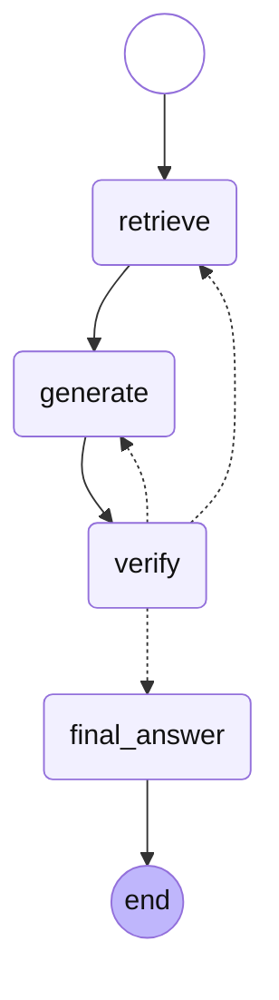

## 회고


7주차 langchain을 LangGraph로 마이그레이션했다. 
langgraph의 노드 안에 7주 과제에서 쓰던 langchain을 그대로 활용했다.
```
chain = (prompt_template | structured_model)
```
원래 이렇게 하는 건가?
하다보니 좀 이상한 것 같아서 prompt template과 langchain을 사용하는 것에서 message로 바꿔봤다. 이게 더 나을진 모르겠지만 message 배웠는데 써봐야지.

만들다 보니깐 LLM 출력으로 흐름을 조절할 필요성을 느꼈다. 어떻게 구현할까 고민하던 도중, 저번에 배운 출력 구조화가 생각났다. Pydantic `with_structured_output()`으로 LLM 출력을 구조화했는데, 생각보다 잘 작동했다. 원래 이렇게 쓰는 건가? `answer["field"]`가 아니라 `answer.field`로 접근한다는 것도 배웠다.

원래는 count 변수를 State에 추가해서, 0회면 그냥 넘어가고 일정 횟수 이상이면 LLM이 "난 모르겠다"고 이실직고하는 방식으로 구현하려 했는데, TypedDict로 State를 정의할 때, 첫 invoke에서 없는 키를 `state["key"]`로 접근하면 KeyError가 나는데.클로드쌤이 `state.get("key", default)`를 추천해줘서 임시방편으로 그렇게 구현했다. 나중에 count 기능 추가할 계획이다.(추가함)
count 기능 추가해서 이제 유저가 설정한 limit=4 넘으면 자동으로 루프 탈출하고 그 사유가 verify 통과가 아닌 limit 이라면, 별도의 프롬프트를 통해 모르겠다고 이실직고한다. final_answer 노드를 따로 만들어야 했다


gemini 2.5 flash를 사용했는데, 나중에 내 언어모델을 만들면 그 둘을 선택해서 할 수 있도록 할 계획이다.
더 좋은 모델을 verify 하는 데에, 또 evaluate.py에 사용하지 못했다는 한계점이 있다.
evaluate.py는 토큰 없어서 실행 안해봤지만 연결 최신화해서 langsmith 인식은 해둬서 tracing은 성공했다.
claude 새 api 키 받은걸로 할 수 있겠지만, 아깝기도 하고 무섭기도 해서.. 그리고 파인만 문서를 다 chromadb로 임포트하겠다는 계획이 있어서 그거에 우선 사용할 예정이다. 리필되는 월말에 한번 해야지.. 언제 리필되더라 확인해봐야겠다.

모델 선택 기능을 추가했다. `model_map`에 gemini랑 claude를 딕셔너리로 등록해두고, FastAPI에서 `Literal["gemini", "claude"]`로 입력을 제한해서 State로 흘려보내면, generate/verify에서 `model_map[state["model"]]`로 꺼내 쓰는 방식이다. 임베딩은 이미 gemini로 해놨으니 바꿀 수 없고, LLM만 선택 가능하다. 나중에 개인 언어모델 만들면 그것도 넣어봐야겠다.
기본적으로는 fastapi에서 선택할 수 있게 했고,
def invoke_with_fallback(state, messages, use_tools=False, structured=None):
로 우선 gemini를 쓰고, 안되면 claude로 바꾸는(vice versa) 기능을 추가했다.

1:N 멘토링에서 인코딩할때 쓴 gemini-api를 다 사용하면 RAG가 작동을 안한다는 문제를 털어놓은 후, 고민 후 huggingface의 모델 BAAI/bge-m3를 사용해서 모든 문서를 다시 인코딩했다.
문서는 The Feynman Lectures on Physics 텍스트를 가져왔다. 6주차 과제부터 그거 썼었다.
무려 리처드 파인만 교수님이 물리학 강의할 때 쓰시던 노트이다. 물리 교과서가 변하는 일은 자주 없기에, 현재에도 중요한 insight들을 많이 담고 있고, 놀랍도록 친절하다. 칼텍 사이트에 무료로 공개하셨는데, 물리(+영어+수학)를 취미로 공부하고 싶으면 충분히 도움받을 수 있다. 나도 다시 읽어야지..
https://www.feynmanlectures.caltech.edu/
"I learned very early the difference between knowing the name of something and knowing something." 
나는 아주 일찍 무언가의 이름을 아는 것과 그것을 아는 것 사이의 차이를 배웠다.- 리처드 파인만

fastapi에서 prompt, top_k, limit 정할 수 있게 했다. 나중에 프론트도 간이로 만들어보면 좋겠다. doc 괜찮긴 한데..

tool calling도 붙였다. generate 단계에서 LLM한테 DuckDuckGo, Wikipedia, ArXiv tool 목록을 `bind_tools()`로 넘겨주면, LLM이 스스로 어떤 tool을 쓸지 판단해서 `tool_calls`를 반환한다. 코드에서 그걸 받아서 직접 실행하고, 결과를 `Document`로 감싸서 RAG context에 합쳐 generate에서 활용하는 방식이다.

tool로 사용하려 했던 WikipediaQueryRun과 ArxivQueryRun이 제대로 작동하지 않아서 DuckDuckGoSearchRun 만으로 웹검색을 시도했다. WolframAlphaQueryRun로 수식 검증 tool도 활용해보고 싶다.

한 가지 더. 원래 verify에서 fix 판단하면 바로 generate로 돌아갔는데, 생각해보니 같은 모델이 틀린 답을 내고 같은 모델이 그걸 평가하는 구조라 근본적인 한계가 있다. 고친다고 해도 결국 같은 눈으로 보는 거니까. 그래도 검색해오는 문서라도 늘리면 판단 근거가 늘어나지 않을까 싶어서, verify에서 `needs_more_context`도 함께 판단하게 했다. 추가 정보가 필요하다고 판단하면 generate가 아니라 retrieve로 돌아가서 top_k를 1 늘려 재검색하는 방식이다. 답변 품질 문제인지 정보 부족 문제인지를 구분해서 라우팅하는 게 핵심인데, 어차피 같은 모델이 판단하는 건데 verify 프롬프트가 그 둘을 얼마나 정확히 구분해낼지는 솔직히 모르겠다.
그래서 모델 선택 기능을 리펙토링해 우선 gemini->안되면 claude로 쓰도록 하드코딩된 걸 함수에 변수를 담아서 주면 다음 안써본 모델 시도하도록 바꾸고, verify에서는 토큰 사용량 제한 에러 없이도 다른 모델을 사용하게끔 해서 일단 다른 모델이 verify하도록 했다.

복잡한 워크플로도 구현 못해봤다. 다만 기초적인 수준의 간단한 Evaluator-Optimizer Pattern 루프를 계획하고, evaluate 해 보았다. 나중에 어떤걸 구현할지 계획해놓은게 있는데, 이제 building block들이 다 모인 느낌이다.

아래 예시가 인상깊다. 물리에서 강력은 두가지 의미가 있는데, 하나는 strong하다는 것이고, 두번째는 강한 핵력(strong interaction)이 있다. 파인만 문서를 인코딩하던 도중에 토큰을 다 써서 앞부분까지밖에 인코딩되지 않아서 뒤의 입자물리 부분이 ChromaDB에 없었는데, 나는 후자(강한 핵력)를 생각하면서 질문해서 RAG로 내용 찾지 못하더라도, 검색해서 알아낼 수 있는지 찾아보려 했지만 인터넷 검색을 동원해 강한 핵력에 대한 정의를 찾고, verify를 걸쳐 둘 중 전자(강하다)를 선택해서 답변을 하였다.
내 의도대로 되지는 않았지만, 내가 생각한 도구들이 적절히 활용된 복잡한 예시였다.

```
      INFO   127.0.0.1:52695 - "GET /openapi.json        
             HTTP/1.1" 200
사용한 도구들:

[Document(metadata={}, page_content='May 20, 2026 - 강한 상호작용은 점근 자유성이라는 성질을 가지므로, 더 높은 에너지(또는 온도)에서 강력의 강도가 감소한다. 그 강도가 전기·약 상호작용과 같아지는 이론적 에너지가 대통일 에너지이다. 그러나 이 과정을 기술하는 대통일 이론은 아직 성공적으로 정식화되지 못했고, 대통일은 물리학의 ... September 8, 2025 - 기본 상호작용(基本 相互作用, 영어: fundamental interaction · )은 우주에 존재하는 기본적인 네 가지 힘을 말한다. 네 가지 이외의 상호작용인 제5의 힘이 있다는 주장도 있다. ... ↑ “Standard Model of Particles and Interactions”. ... April 21, 2026 - 이 입자물리학의 표준 모형은 ... 약한 상호작용이 전기·약 작용으로 통합할 수 있다는 것을 확인하였다. 표준 모형은 힉스 메커니즘은 아직 완전하게 관측되진 않았고, 중성미자 진동 등 표준 모형으로 설명되지 않은 현상이 나타나는 등 완전히 정립되지 못했다. 강력과 전약력 사이의 관계를 설명하는 대통일 이론은 초대칭 등의 물리학의 미해결 ... December 27, 2025 - )은 자연계의 4가지 힘인 중력, 전자기력, 약한 상호작용 그리고 강한 상호작용을 통합하려는 시도의 대표적인 접근 방식이다. 중력장과 전기장, 자기장 그리고 핵력장이 같은 근원을 지닌다는 물리학 이론의 한 분야이다. April 13, 2026 - 강한 상호작용과 약한 상호작용의 이해를 위한 연구에서 물리학자들은 핵과 전자를 아주 높은 에너지에서 충돌시켰다. 이 연구는 약력, 강력, 전자기력을 설명하는 표준 모형의 크라운 쥬웰인 소립자 물리학이 되었다.')]
1번쨰 시도: 
 # 강력(Strong Interaction)이란 무엇인가

## 문서 기반 설명

문서에 따르면, **강력은 원자 간의 상호작용을 담당하는 기본 힘**입니다. 구체적으로:

1. **엄청난 크기**: 강력은 전기력보다 훨씬 강력합니다. 문서에서는 1mm 크기의 모래알 두 개가 30미터 떨어져 있을 때, 강력이 균형을 이루지 않으면 상상할 수 없을 정도의 큰 힘이 작용할 것이라고 설명합니다.

2. **원자의 구성**: 모든 물질(우리 자신 포함)은 강력으로 상호작용하는 양전하(+)와 음전하(-)로 미세하게 구성되어 있으며, 이들이 정교하게 균형을 이루고 있습니다.

## 추가 설명 (지식 보완)

**강력의 특징:**
- **작용 범위**: 극히 짧은 범위(약 10⁻¹⁵m)에서만 작용하며, 주로 **핵 내에서 쿼크와 글루온 사이의 상호작용**을 담당합니다.
- **기본 힘**: 중력, 전자기력, 약한 상호작용과 함께 자연계의 4가지 기본 상호작용 중 하나입니다.
- **에너지 의존성**: 높은 에너지에서는 강도가 감소하는 '점근 자유성' 성질을 가집니다.

강력이 없다면 원자핵이 존재할 수 없어 우주의 모든 물질이 붕괴될 것입니다.

fix_needed=True what_to_fix='답변이 강력(Strong Interaction)의 물리학적 정의를 혼동하고 있습니다. \n\n1. **주요 오류**: 문서의 "strong interaction"은 전기력의 맥락에서 원자 간의 상호작용을 일반적으로 설명한 것이 아니라, 전기력의 강도를 상대적으로 표현한 것입니다. 답변이 이를 핵력(강한 핵력)의 정의로 잘못 해석했습니다.\n\n2. **문맥 해석 오류**: 문서를 다시 읽으면, "strong interaction"은 전기력이 얼마나 강한지를 강조하기 위한 표현입니다. 문서는 "the interaction between the atoms is electrical"이라고 명시하고 있으며, "strong"은 이 전기력의 강도를 수식하는 형용사입니다.\n\n3. **부분적으로 정정되어야 할 내용**:\n   - 원자 간 상호작용은 강력이 아니라 **전기력(electrical force)**입니다\n   - 강력/강한 핵력은 핵 내의 쿼크와 글루온 사이의 상호작용을 담당하는 것이 맞지만, 이는 문서의 맥락과 무관합니다\n   - 추가 설명 부분은 일반적으로 정확하지만, 문서의 내용과 혼합되어 혼동을 초래합니다' needs_more_context=False
사용한 도구들:

[]
2번쨰 시도: 
 # 강력(Strong Interaction)이란 무엇인가 - 수정본

## 문서 기반 설명

문서에서 "strong interaction"은 **전기력(electrical force)의 강도를 강조하기 위한 표현**입니다. 

1. **전기력의 엄청난 크기**: 문서는 명확히 "the interaction between the atoms is electrical"이라고 명시하면서, 이 전기력이 얼마나 강력한지를 설명하고 있습니다.

2. **구체적 예시**: 1mm 크기의 모래알 두 개가 30미터 떨어져 있을 때, 전기력이 균형을 이루지 않으면 막대한 힘이 작용한다고 합니다.

3. **원자의 구성**: 모든 물질은 양전하(+)와 음전하(-)로 이루어져 있으며, 이들 사이의 강한 전기적 상호작용이 정교하게 균형을 이루고 있습니다.

## 정정 사항

- **원자 간 상호작용 = 전기력(electrical force)**이지, 핵력의 "강력"과는 다릅니다
- 문서의 "strong interaction"은 전기력의 강도를 수식하는 표현일 뿐, 입자물리학의 기본 상호작용 중 하나인 '강한 핵력'을 의미하는 것이 아닙니다

지적해주셔서 감사합니다. 문서의 맥락을 정확히 해석하지 못했습니다.

fix_needed=False what_to_fix='답변이 정확합니다. 문서에서 "strong interaction"은 원자 간의 전기적 상호작용의 강도를 나타내는 표현이며, 입자물리학의 기본 상호작용인 \'강한 핵력\'을 의미하지 않습니다.' needs_more_context=False
```

## 07 LCEL vs 08 LangGraph 비교

| 항목 | 07 LCEL | 08 LangGraph |
|---|---|---|
| 구조 | 선형 파이프 (`\|`) | 노드 + 엣지 그래프 |
| 루프 | 불가 (DAG) | 가능 (사이클 허용) |
| 상태 관리 | 없음 | `TypedDict` State |
| 조건 분기 | `RunnableBranch` | `add_conditional_edges` |
| 에이전트 패턴 | 어려움 | 자연스럽게 구현 가능 |