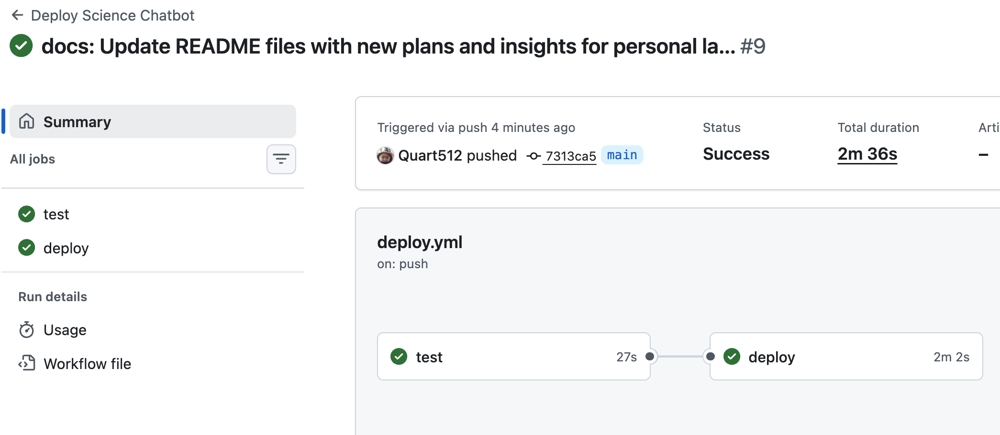

# 11주차 과제 — Docker 패키징 + Compose + EC2 배포 + CI/CD

> 과제 원문: (1) 개인 프로젝트를 Docker 컨테이너로 패키징하고 Docker Compose로 실행 (2) 컨테이너 이미지를 AWS EC2에 배포해 외부에서 접근 가능하도록 구성 (3) GitHub Actions로 push 시 자동 빌드·배포되는 CI/CD 파이프라인 구축

대상 프로젝트: `Science_Chatbot` — FastAPI(`science-chatbot`) + 파인튜닝 Qwen 모델 서빙(`llama-server`, 선택적 컨테이너)

진행 상황: **(1) 완료** / **(2) 완료** — EC2 배포 + 외부 접근 검증까지 마침 / **(3) 완료** — GitHub Actions CI/CD 파이프라인 구축 및 검증까지 마침

---

## 0. 전체 흐름 한눈에

```
[로컬 개발]
   Dockerfile 작성 → docker compose build  (science-chatbot 이미지 생성)
        ↓
[Docker Hub]
   docker tag → docker push  (레지스트리에 이미지 업로드)
        ↓
[EC2] — 최초 1회, 수동
   인스턴스 생성 → 보안 그룹(22, 8000) 설정 → Docker 설치
   → docker compose pull && up -d → (OOM 발생 → 스왑 2GB로 해결)
        ↓
[GitHub Actions] — 이후, 자동
   main push → 이미지 재빌드+push(Docker Hub) → SSH로 EC2 접속 → pull + up -d
```

**놓치기 쉬운 조각들**:
- "이미지 하나"가 아니라 **컨테이너 두 개짜리 Compose 구성**(`science-chatbot` 상시 실행 + `llama-server`는 `profiles`로 선택 실행, 서로 내부 네트워크로 통신) → §2
- GitHub Actions로 자동화하기 **전에** 위 수동 단계(EC2 생성·보안 그룹·Docker 설치·수동 pull/실행·스왑 설정)를 먼저 한 번 거쳤음 → §4
- GitHub Actions가 작동하려면 Docker Hub 인증정보·EC2 SSH 키·EC2 IP를 **GitHub Secrets**로 미리 등록해야 했음 → §5
- 자동화 과정에서 이슈 두 번 — 매번 새 러너라 빌드 캐시가 없어서(→ `type=gha` 캐시 추가), SSH 보안 그룹이 "내 IP"로 막혀 있어서 러너 timeout(→ SSH만 Anywhere로 개방) → §5.2
- 이 전체를 만들면서 파고든 네트워킹·볼륨 원리는 §6, §7에 별도 정리

---

## 1. Docker 패키징 — Dockerfile

### 1.1 설계 포인트

```dockerfile
FROM python:3.14-slim
COPY --from=ghcr.io/astral-sh/uv:latest /uv /uvx /bin/

WORKDIR /app
COPY pyproject.toml uv.lock ./

RUN uv sync --no-install-project --frozen

COPY ./ ./
RUN uv sync --frozen

EXPOSE 8000

CMD ["uv", "run", "uvicorn", "main:app", "--host", "0.0.0.0", "--port", "8000"]
```

| 결정 | 이유 |
|---|---|
| `FROM python:3.14-slim` (파이썬 미리 설치된 베이스) | `pyproject.toml`의 `requires-python`(>=3.14)과 매칭 — uv가 별도 다운로드 없이 이미 있는 인터프리터를 그대로 재사용 |
| `COPY --from=ghcr.io/astral-sh/uv:latest /uv /uvx /bin/` | uv를 별도 설치 과정 없이, uv 공식 이미지 안에 이미 컴파일된 바이너리를 그대로 복사(멀티스테이지 COPY) — 설치 시간 단축 |
| 의존성 설치를 두 단계로 분리 | 아래 §1.2 참고 |
| 첫 `uv sync`에 `--no-install-project` | 아직 전체 소스(및 `pyproject.toml`이 참조하는 `README.md`)가 없는 시점이라 프로젝트 자체 설치는 생략, 의존성만 먼저 설치 |
| `--frozen` | `uv.lock`에 적힌 버전을 그대로 재현 — lock과 안 맞으면 조용히 재계산하지 않고 에러 |
| `CMD`에 `--host 0.0.0.0` 명시 | 기본값 `127.0.0.1`은 컨테이너 내부에서만 보이는 주소라 포트 매핑을 해도 외부에서 접속 불가 — 모든 인터페이스에서 받도록 명시 필요 |

### 1.2 레이어 캐싱 — RUN을 두 번 나눈 이유

**효과**: 코드만 고쳐서 재빌드할 때, 의존성 재설치 없이 캐시를 재사용해서 빌드가 빨라짐. 안 나눴으면 `main.py` 한 줄만 바꿔도 185개 패키지를 매번 처음부터 재설치했을 것.

**언제 의미가 있나**: **최초 빌드**엔 효과 없음(캐시가 아예 없으니 처음부터 다 설치). **재빌드**할 때만 효과가 있음.

**원리**: Docker는 각 레이어를 다시 실행할지를 **그 줄의 입력이 바뀌었는지**로 판단한다.

```dockerfile
COPY pyproject.toml uv.lock ./
RUN uv sync --no-install-project --frozen   # 입력 = 이 두 파일뿐

COPY ./ ./
RUN uv sync --frozen                         # 입력 = 전체 코드까지 포함
```

나누기 전엔 하나의 `RUN uv sync`가 "의존성 파일 + 전체 코드"를 통째로 입력받아서, 코드 한 줄만 바뀌어도 레이어 전체가 무효화됐다. 나눈 뒤엔 첫 번째 `RUN`의 입력이 `pyproject.toml`/`uv.lock`뿐이라, 이 둘이 그대로면 코드가 아무리 바뀌어도 캐시가 재사용된다.

> Dockerfile 자체는 **매 빌드마다 항상 다시 읽힌다** — 레이어 캐싱은 "Dockerfile을 건너뛰는 것"이 아니라 "각 레이어를 재실행할지 캐시로 대체할지"를 판단하는 것. CI(GitHub Actions)에서 이 캐시가 왜 별도 설정이 필요했는지는 §5.2 참고.

### 1.3 .dockerignore

```
docs/
.git/
.venv/
evaluation/results/
.env
```

`.env`는 `COPY ./ ./`로 이미지에 그대로 구워지면 실제 API 키가 이미지 레이어에 영구히 남는 보안 문제라 반드시 제외. `docs/`는 컨테이너 실행에 전혀 필요 없는 문서라 빌드 컨텍스트 자체에서 제외(빌드 시점에 아예 인식되지 않음 — 런타임에 볼륨으로 채워지는 것과는 다른 배제 방식).

---

## 2. Docker Compose — 다중 컨테이너 구성

### 2.1 설계 배경 — Qwen-tuned를 별도 컨테이너로 분리

원래 계획은 RAM 제약(EC2 프리티어) 때문에 파인튜닝 모델(`Qwen-tuned`, llama-server) 자체를 배포에서 제외하는 것이었으나, **선택적으로 켤 수 있는 별도 컨테이너**로 분리하는 쪽으로 변경 — EC2 RAM 부담 없이 필요할 때만 실행 가능하고, 컨테이너 간 통신도 실습할 수 있어서.

```yaml
services:
  science-chatbot:
    build: .
    image: quart512/science-chatbot:latest
    ports:
      - "8000:8000"
    env_file:
      - .env
    environment:
      - LOCAL_MODEL_URL=http://llama-server:8080/v1
    volumes:
      - "./chroma_db:/app/chroma_db"
      - "huggingface-cache:/root/.cache/huggingface"

  llama-server:
    command: -m /app/models/qwen_finetuned_Q4_K_M.gguf --port 8080 --host 0.0.0.0
    image: ghcr.io/ggml-org/llama.cpp:server
    ports:
      - "8080:8080"
    volumes:
      - "./models:/app/models"
    profiles: ["llama"]

volumes:
  huggingface-cache:
```

### 2.2 Compose 메커니즘 요약

| 개념 | 내용 |
|---|---|
| `profiles: ["llama"]` | `docker compose up`(profile 없이)엔 `llama-server`가 아예 시작되지 않음. `docker compose --profile llama up`으로 명시했을 때만 실행 — 선택적 기동 |
| `image:` vs `build:` | `science-chatbot`만 `build: .`로 Dockerfile을 거쳐 빌드됨. `llama-server`는 `build:` 키 자체가 없고 `image:`만 있어서 우리 Dockerfile과 완전히 무관 — llama.cpp 팀이 미리 만들어둔 이미지를 그대로 `pull` |
| `command:` | 이미지의 `ENTRYPOINT`(이미 `llama-server` 바이너리로 고정)에 붙는 인자만 지정 — 실행 파일 이름을 다시 적으면 중복. 리스트로 한 문자열을 통째로 넣으면 인자 하나로 뭉쳐 인식되므로, 공백으로 자동 분리되는 문자열 형태로 작성 |
| `environment:` vs `env_file:` | 같은 키가 둘 다에 있으면 `environment:`가 우선 적용됨. `.env`는 로컬 직접 실행(`uv run`)과 공유되는 파일이라 로컬 기본값(`localhost:8080`)을 유지하고, Compose 실행 시에만 `LOCAL_MODEL_URL`을 `environment:`로 덮어써서 두 실행 환경을 분리 |

> 컨테이너 간 통신(서비스 이름 DNS)과 볼륨(바인드 마운트/네임드 볼륨) 원리는 개념이 많아서 별도 섹션으로 분리 — **네트워킹 → §6, 볼륨 → §7**.

### 2.3 검증 — science-chatbot 단독 기동

```
docker compose up --build
```

빌드 17/17 스텝 성공, 컨테이너 정상 기동:
```
science-chatbot-1  | INFO:     Uvicorn running on http://0.0.0.0:8000 (Press CTRL+C to quit)
```
호스트에서 `curl http://localhost:8000/docs`로 포트 매핑 확인 완료.

### 2.4 검증 — 컨테이너 간 통신 (llama-server 포함)

```
docker compose --profile llama up --build
```

```
llama-server-1  | ... llama_server: loading model '/app/models/qwen_finetuned_Q4_K_M.gguf'
llama-server-1  | ... llama_server: model loaded
llama-server-1  | ... llama_server: listening on http://0.0.0.0:8080
```

실제 쿼리(`model: "Qwen-tuned"`)를 보낸 결과, science-chatbot이 `llama-server:8080`으로 정상 접속해 응답을 받아왔고, 그 과정에서 Gemini 쿼터 소진(`429 RESOURCE_EXHAUSTED`) → claude fallback → verify 재시도 루프(4회) → 최종답변까지 기존 그래프 로직 그대로 동작함을 확인:

```
science-chatbot-1  | LLM 모델 사용: Qwen-tuned
...
science-chatbot-1  | langchain_google_genai.chat_models.ChatGoogleGenerativeAIError: ... 429 RESOURCE_EXHAUSTED ...
science-chatbot-1  | 모델 오류! fallback인 claude 모델로 전환
...
science-chatbot-1  | -----최종답변-----
science-chatbot-1  | INFO:     192.168.65.1:25935 - "POST /query HTTP/1.1" 200 OK
```

**결론: 컨테이너 간 통신, profiles 기반 선택적 기동, 기존 fallback/verify 로직 모두 Docker 환경에서 정상 동작 확인.** (답변 품질 자체는 1.5B 파인튜닝 모델의 한계이며 인프라 문제 아님)

### 2.5 트러블슈팅 — Docker Desktop에 남아있던 옛 이미지

로컬 이미지 목록에 낯선 이름 `science_chatbot-science-chatbot:latest`가 하나 더 있었음. `docker-compose.yml`에 `image: quart512/science-chatbot:latest`를 넣기 **전**, Compose가 자동으로 붙이는 기본 이름 규칙(`<프로젝트폴더명>-<서비스명>`)으로 빌드됐던 옛 이미지 — 그 키를 넣은 뒤로는 매번 `quart512/science-chatbot`으로만 태그된다.

이 옛 이미지를 쓰던 컨테이너가 한동안 남아있었는데, 로컬에서 `--build`로 다시 빌드하면서 Compose가 컨테이너를 새 이미지로 교체하는 순간 자연스럽게 정리됨(Docker Hub 업로드 여부와는 무관 — 순수 로컬 이미지/컨테이너 이름 문제). Docker Desktop의 초록/흰 점은 "그 이미지로 뜬 컨테이너가 지금 있는지"만 나타내므로, 지금은 아무 컨테이너도 안 쓰니 `docker image rm`으로 안전하게 삭제 가능.

---

## 3. 이미지 레지스트리 — Docker Hub

### 3.1 태깅과 레지스트리 주소

```
docker tag science_chatbot-science-chatbot:latest quart512/science-chatbot:latest
docker push quart512/science-chatbot:latest
```

`docker tag`는 이미지를 복제하지 않는다 — 같은 이미지 레이어(동일 Image ID)에 이름표를 하나 더 붙이는 것뿐. Docker 이미지 이름(`[레지스트리주소/]계정이름/저장소이름:태그`)은 그 자체로 "어디로 push할지"를 결정하는 주소 정보를 담고 있음. Git으로 비유하면, `git remote add origin <url>`처럼 이름(별명)과 실제 주소(url)가 분리된 게 아니라, **태그 문자열 자체가 곧 remote 주소** — 별도의 remote 등록 과정 없이 이름이 곧 목적지.

### 3.2 결과

```
The push refers to repository [docker.io/quart512/science-chatbot]
...
latest: digest: sha256:e73378d560fdff7cde5fedcf919e05b0c3bb5f7394c5363ba284147eb5e5b3f1 size: 856
```

Push 성공. 이미지 크기 8.78GB — `docker history`로 확인한 결과 `RUN uv sync --no-install-project --frozen` 레이어가 5.43GB로 대부분을 차지. 코드나 모델 가중치가 아니라 RAG·임베딩(bge-m3/sentence-transformers/torch 계열)과 Gemini/Claude SDK, chromadb, langchain 생태계 라이브러리 전체가 원인 — 추후 최적화 여지(불필요 extras 제거, CPU 전용 torch wheel 등)로 남겨둠.

---

## 4. EC2 배포 — 완료

- [x] 이미지 레지스트리(Docker Hub) push
- [x] EC2 인스턴스 생성 — `t4g.micro`(Graviton/arm64, 프리티어), Ubuntu 24.04 LTS **arm64** AMI. 로컬 이미지가 Apple Silicon 맥에서 arm64로 빌드됐기 때문에 인스턴스·AMI 아키텍처를 그에 맞춰 선택(불일치 시 실행 불가)
- [x] EC2에서 이미지 pull + `docker compose up` 실행
- [x] Security Group 8000/22 포트 오픈 (소스: 내 IP로 제한 — 10주차 WireShark 캡처로 확인한 HTTP 평문 노출 문제가 공인망에서는 실제 위협이 되므로)

### 4.1 트러블슈팅 — OOM으로 인한 컨테이너 강제 종료

첫 실행에서 컨테이너가 시작 직후 `Exited (137)`로 죽음 — 137(=128+9=SIGKILL)은 커널 OOM Killer의 전형적인 신호. `t4g.micro`의 RAM 1GB로는 bge-m3 임베딩 모델 로딩 순간의 메모리 스파이크를 못 버팀 (사전에 To Do List에 적어뒀던 위험이 실제로 발생).

**해결 — 스왑 2GB 추가**:
```bash
sudo fallocate -l 2G /swapfile
sudo chmod 600 /swapfile
sudo mkswap /swapfile
sudo swapon /swapfile
echo '/swapfile none swap sw 0 0' | sudo tee -a /etc/fstab
```
적용 후 재시도하니 `Loading weights` → `Uvicorn running on http://0.0.0.0:8000`까지 정상 통과, 이후 `Exited` 없이 안정적으로 유지됨.

### 4.2 검증 — 외부에서 실제 쿼리 성공

```
science-chatbot-1  | INFO:     211.244.225.211:58865 - "GET /docs HTTP/1.1" 200 OK
science-chatbot-1  | 질문: 중력이란?
science-chatbot-1  | LLM 모델 사용: gemini
...
science-chatbot-1  | ---verify 단계 시작---
science-chatbot-1  | LLM 모델 사용: claude
science-chatbot-1  | 수정 필요한가: False
science-chatbot-1  | -----최종답변-----
science-chatbot-1  | INFO:     211.244.225.211:58866 - "POST /query HTTP/1.1" 200 OK
```

맥 브라우저/터미널에서 EC2 퍼블릭 IP로 `/docs`, `/query` 둘 다 정상 응답 확인 — Security Group의 "내 IP" 제한도 의도대로 동작(요청 출발지가 등록한 IP와 일치). gemini 생성 → claude 교차 verify까지 로컬과 동일한 그래프 로직이 EC2에서도 그대로 재현됨.

**참고**: `llama-server`(Qwen-tuned)는 이번엔 켜지 않음 — science-chatbot 하나만으로도 스왑을 동원해야 겨우 안정화된 RAM 상황이라, 동시 기동은 다음 단계로 미룸.

### 4.3 운영 노트 — 중지/재시작, 스토리지 구조, 모니터링 사각지대

**인스턴스 중지→재시작 시 체크리스트** (비용 절약을 위해 안 쓸 때 중지하는 경우):
- 퍼블릭 IP가 바뀐다(재부팅과 다름 — 중지 후 재시작 시 새 IP 배정). SSH·브라우저 접속 주소를 매번 새로 확인해야 함
- 컨테이너는 자동으로 안 켜짐 — `docker-compose.yml`에 `restart:` 정책을 안 넣어뒀으므로, 재접속 후 `docker compose up -d`를 다시 실행해야 함
- 스왑은 `/etc/fstab`에 등록해뒀으므로 재부팅해도 자동 재활성화(재설정 불필요)
- pull한 이미지·`.env`·`docker-compose.yml`은 EBS 볼륨(디스크)에 남아있으므로 재전송 불필요 — RAM에 상주하던 실행 상태만 사라짐

**Docker 데이터의 실제 저장 위치**: 컨테이너 안에서 보이는 `/app` 같은 경로는 실제로는 EC2 인스턴스와 별개의 저장공간이 아니라, 우리가 잡아준 **그 20GB EBS 루트 볼륨 안의** `/var/lib/docker/`(OverlayFS 레이어들이 겹쳐 보이는 형태)일 뿐. 이미지·컨테이너 쓰기 레이어·볼륨이 전부 이 하나의 디스크를 나눠 씀 — 스토리지 크기를 20GB로 늘렸던 이유가 여기서 실질적으로 소모됨. `docker system df`로 항목별 사용량 확인 가능.

**AWS 콘솔에서 메모리·스왑 사용량이 안 보이는 이유**: EC2 기본 모니터링(CloudWatch)은 하이퍼바이저 바깥에서 관찰 가능한 지표(CPU, 네트워크, EBS I/O)만 기본 제공 — RAM·스왑 사용량은 게스트 OS 내부 상태라 별도 CloudWatch Agent 설치 없이는 AWS 쪽에서 안 보임. 지금처럼 SSH로 `free -h` 직접 확인하는 게 가장 간단한 방법.

---

## 5. GitHub Actions CI/CD — 완료

`.github/workflows/deploy.yml` — `main` push 시 자동으로 테스트→빌드→push→EC2 배포까지 실행 (테스트 게이트를 추가한 최신 버전 — 추가 배경과 설계는 §8 참고):

```yaml
name: Deploy Science Chatbot

on:
  push:
    branches: [main]
jobs:
  test:
    runs-on: ubuntu-24.04-arm
    steps:
      - name: 코드 체크아웃
        uses: actions/checkout@v4

      - name: uv 설치
        uses: astral-sh/setup-uv@v3

      - name: 테스트 (톨게이트)
        run: |
          uv sync
          uv run pytest

  deploy:
    needs: test # test job이 실패(또는 취소)하면 이 job은 시작조차 안 함
    runs-on: ubuntu-24.04-arm
    steps:
      - name: 코드 체크아웃
        uses: actions/checkout@v4

      - name: Docker Hub 로그인
        uses: docker/login-action@v3
        with:
          username: ${{ secrets.DOCKERHUB_USERNAME }}
          password: ${{ secrets.DOCKERHUB_TOKEN }}

      - name: 이미지 빌드 + push
        uses: docker/build-push-action@v5
        with:
          context: .
          push: true
          tags: quart512/science-chatbot:latest

      - name: EC2 배포
        uses: appleboy/ssh-action@v1
        with:
          host: ${{ secrets.EC2_HOST }}
          username: ubuntu
          key: ${{ secrets.EC2_SSH_KEY }}
          script: |
            cd ~/science-chatbot
            docker compose pull
            docker compose up -d
            docker image prune -f
```

### 5.1 설계 포인트

| 결정 | 이유 |
|---|---|
| `runs-on: ubuntu-24.04-arm` | 로컬 이미지가 Apple Silicon 맥에서 arm64로 빌드됐던 것과 동일하게, EC2(`t4g.micro`, arm64)와 아키텍처를 맞춰야 함. GitHub 기본 러너(`ubuntu-latest`)는 amd64라 그대로 쓰면 EC2에서 pull 후 실행 불가 — Public 저장소는 arm64 호스티드 러너가 무료(2025-08 GA)라 에뮬레이션(QEMU) 없이 네이티브로 빌드 |
| `docker/build-push-action`에 `tags:` 명시 | `docker-compose.yml`의 `image:`는 `docker compose` 전용 설정이라, 이 액션(내부적으로 일반 `docker build`)은 compose 파일을 아예 읽지 않음 — 별도로 태그를 알려줘야 함 |
| `secrets.*` | Docker Hub 인증정보·EC2 SSH 키를 코드에 직접 적지 않고 저장소 Settings → Secrets에 등록해 참조 |

### 5.2 트러블슈팅

- **워크플로우 파일 push 거부** (`refusing to allow a Personal Access Token to create or update workflow ... without workflow scope`): `.github/workflows/` 안의 파일은 자동 코드 실행이 가능하므로, 일반 코드 push 권한과 별도로 PAT에 `workflow` 스코프가 명시적으로 필요함 — 스코프 추가한 새 토큰 발급 후 재인증
- **EC2 배포 단계 `dial tcp ***:22: i/o timeout`**: 인증 실패(`refused`)가 아니라 연결 자체가 안 된 것 — 원인은 보안 그룹 SSH(22) 소스를 "내 IP"로만 제한해뒀기 때문. GitHub Actions 호스티드 러너는 매번 다른(예측 불가능한) IP에서 접속하므로 특정 IP 화이트리스트로는 대응 불가 → SSH 소스를 Anywhere(0.0.0.0/0)로 변경. SSH는 비밀번호 인증이 꺼져있고 키 기반 인증만 허용되므로(무차별 대입 사실상 불가능), 소스 IP를 넓혀도 실질적 위험은 낮다고 판단(포트 8000의 앱 API는 반대로 자체 인증이 없어 IP 제한이 유일한 방어선이라 그대로 유지)
- **이미지 빌드가 매번 의존성 전체(torch·nvidia-cuda 등 5GB+)를 처음부터 재설치 — 시도했으나 포기함**: 로컬(맥)에서 Dockerfile의 레이어 캐싱이 잘 작동했던 건 **같은 머신, 같은 Docker 데몬**이 이전 빌드의 레이어를 디스크에 들고 있었기 때문. 반면 GitHub 호스티드 러너는 워크플로우 실행마다 **완전히 새 가상머신**을 띄웠다가 종료 후 통째로 버림 — 이 머신 입장에선 "이전 빌드"라는 게 아예 존재한 적이 없어 캐시를 재사용할 대상 자체가 없음.
  - **1차 시도 — `cache-to: type=gha,mode=max`**: 캐시를 GitHub 쪽에 영속적으로 저장해두는 방식. 적용 과정에서 `Cache export is not supported for the docker driver` 에러가 나서(기본 `docker` 드라이버는 캐시 export 미지원) `docker/setup-buildx-action`으로 `docker-container` 드라이버를 먼저 세팅해야 했음.
  - **실패 원인 진단**: 적용 후에도 의존성 설치 레이어(2.8GB)가 매번 캐시 미스로 재실행됨. GitHub Actions 캐시 저장소의 실제 항목을 직접 대조해보니, 베이스 이미지 레이어(수십 KB~MB급)는 정상적으로 캐시 히트했지만 그 2.8GB 레이어만 유독 실패 — 삭제(eviction)된 것도 아니었음(예전 블롭이 목록에 그대로 남아있음에도 이번 빌드가 못 찾고 새로 만듦). 원인을 찾아보니 **GitHub Actions 캐시 API는 파일 하나당 400MB 제한**이 있어, 2.8GB 레이어는 여러 조각으로 쪼개져 저장되는데 이걸 다시 정확히 찾아 재조립하는 과정이 buildkit의 `gha` 캐시 백엔드에서 아직 불안정함(`moby/buildkit` 저장소에 "blob not found", `mode=max`에서의 export 실패 등으로 다수 보고된 알려진 이슈).
  - **결론 — 캐싱 포기**: registry 캐시(`type=registry`, Docker Hub에 캐시 전용 태그로 저장)로 바꾸면 이 400MB 청크 제한 자체가 없어 해결될 가능성이 높지만, 검증하지 않은 상태에서 무작정 도입하기보다 **일단 캐싱 없이 안정적으로 동작하는 지금 상태를 유지**하기로 결정. 매 배포마다 의존성을 재설치하는 비용(빌드 자체는 uv 덕에 약 30초로 빠름, 병목은 오히려 이미지 push(~157초)와 캐시 export 시도(~217초) 쪽이었음 — 캐싱을 포기하면 이 export 비용도 같이 사라짐)은 감수 가능한 수준이라 판단.

### 5.3 검증

`deploy.yml` push 자체가 트리거가 되어 워크플로우 실행 → 체크아웃/로그인/빌드+push/EC2 배포 4단계 전부 성공(`succeeded ... 4m 26s`). 이제 `main`에 push할 때마다 자동으로 EC2에 최신 이미지가 반영됨.



---

## 6. 네트워킹 심화

> §2의 Compose 구성이 실제로 "왜" 동작하는지 파고든 내용. 각 항목은 **내가 이해한 방식(정리)** → **맞았는지/뭘 놓쳤는지** 순서로 정리.

### 6.1 세 겹의 네트워크 주소

지금까지 나온 IP는 사실 세 개의 다른 층이다.

| 층 | 예시 | 역할 |
|---|---|---|
| 퍼블릭 IP | `15.164.x.x` | 인터넷 → EC2 |
| 프라이빗 IP | `172.31.x.x` | VPC 내부에서 EC2를 가리킴 |
| 컨테이너 내부 IP | `172.1x.0.x` | Compose 브리지 네트워크 안, 컨테이너마다 |

**내 정리**: "로컬에서도 127.0.0.1과는 다른 IP가 컨테이너별로 하나씩 생기는 거야?" → **맞음** — 이건 EC2(리눅스)만의 특성이 아니라 **Docker 엔진 자체의 동작**. 맥에서 Docker Desktop을 써도 내부에 작은 리눅스 VM이 돌면서 똑같이 브리지 네트워크 + 컨테이너별 IP가 생긴다.

**localhost vs 프라이빗 IP 유비**: "평행적인 관계에 대해 얘기한 거지, 두 개가 같다는 의미는 아니었어." → 맞음. "바깥에서 접근 불가한 안쪽 주소"라는 축에서는 유비가 성립하지만, 엄밀히는 다른 질문에 답하는 주소다 — `localhost`는 "자기 자신에게"(묻는 주체에 따라 대상이 달라짐), 프라이빗 IP는 "같은 사설망의 다른 기기에게"(고정된 실제 주소). 1:1로 짝짓는다면 오히려 **컨테이너 내부 IP**가 프라이빗 IP와 더 정확히 대응한다.

### 6.2 컨테이너 ↔ 컨테이너 — Docker 내장 DNS

**내 정리**: "기존에 localhost:8080으로 해도 됐던 건 실제로 로컬에서 llama-server가 8080 포트로 돌아가고 있어서 가능했지만, 이제 컨테이너가 분리되었으니 docker에서 열 때에는 저 주소로 열도록 오버라이드되어서 저 주소로 열고, 저 주소로 쿼리 날리고, 저 주소에서 받는다는 거구나." → **맞는 요약**. 메커니즘 보충:

```python
# models.py
base_url=os.getenv("LOCAL_MODEL_URL", "http://localhost:8080/v1")
```
```yaml
# docker-compose.yml
science-chatbot:
  environment:
    - LOCAL_MODEL_URL=http://llama-server:8080/v1   # 이 오버라이드가 실제로 쓰이는 값
```

통신이 되는 건 기본값(`localhost:8080`) 때문이 아니라 Compose가 그 기본값을 **환경변수로 덮어쓰기** 때문이다. 오버라이드가 없었다면 기본값 `localhost`가 컨테이너 안에서 "자기 자신"을 가리켜서 실패했을 것.

**내 정리**: "그러면 서비스와 IP 주소를 어떻게 연결지어? 우리는 서비스 이름과 IP 도메인 이름이 같잖아. 그게 조건이야?" → **정확히 그게 조건**. `docker-compose.yml`의 `services:` 아래 키 이름(`llama-server`) 그 자체가 곧 DNS 호스트네임으로 자동 등록된다. 우연히 같은 게 아니라 두 곳(compose 서비스 이름, `LOCAL_MODEL_URL` 값)에 일부러 같은 문자열을 맞춰 썼기 때문. 대칭적으로 작동해서 `science-chatbot:8000`도 내부에서 똑같이 통한다(단, `localhost:8000`은 여전히 안 됨 — 각 컨테이너의 "자기 자신"이라서).

메커니즘: Compose가 프로젝트 전용 브리지 네트워크를 만들고 → 각 컨테이너의 `/etc/resolv.conf`에 네임서버 `127.0.0.11`(Docker 내장 DNS)이 자동 등록되고 → 이 DNS가 "서비스 이름 → 현재 내부 IP" 표를 실시간 관리한다.

### 6.3 호스트 ↔ 컨테이너 — 포트 매핑(iptables)

**내 정리**: "8080:8080으로 열어둬서 소통되는 건 아니라는 거네? 단지 열 때 8080으로 열게 설정해두고, 여기서도 8080으로 요청하니깐 가능하고. 만약 내부에서 1234로 소통하고 있고, EC2 IP 설정을 4321로 해서 4321:1234로 docker 열면 EC2IP/4321로 하면 가능하다는 거네?" → **정확히 맞음** — 이게 이 프로젝트 네트워킹에서 가장 핵심적인 통찰이었다:

- **내부 통신**(컨테이너↔컨테이너)은 호스트 포트 매핑과 완전히 무관 — 컨테이너가 실제로 듣는 포트(내부 포트)로 서비스 이름을 통해 직접 감.
- **외부/호스트 접근**은 `ports: "호스트포트:컨테이너포트"` 매핑을 통해서만 가능. Docker 엔진이 컨테이너를 만들 때 그 내부 IP를 이미 알고 있으므로, 이 매핑을 iptables DNAT 규칙으로 직접 심어둔다: "호스트의 X포트로 들어오면 컨테이너 IP의 Y포트로 보내라."

| 경로 | 주소 방식 | 변환 메커니즘 |
|---|---|---|
| 컨테이너 ↔ 컨테이너 | 서비스 이름 | Docker 내장 DNS(127.0.0.11) |
| 호스트/외부 → 컨테이너 | 포트 번호 | iptables DNAT |

**EC2 호스트 자신에서 테스트**(`curl localhost:8080`)는 컨테이너의 "자기 자신" 함정과 다름 — 여기 `localhost`는 EC2 호스트 OS 자신이고, 포트 매핑 덕분에 정상 도달한다.

### 6.4 보안 그룹은 어디에 관여하는가

**내 정리**: "네트워크 보안그룹은 안 바꿔도 되는 거 맞지? 어쩌피 안에서만 소통할 꺼니깐." → **맞음, 그리고 이유가 핵심**: 보안 그룹은 EC2의 실제 네트워크 인터페이스(ENI)를 드나드는 트래픽만 본다. 컨테이너 간 통신은 Docker 내부 브리지망에서 끝나서 ENI를 아예 안 거친다 — 그래서 `llama-server`를 새로 띄워도 보안 그룹은 무관.

| 포트 | 상태 | 이유 |
|---|---|---|
| 22 (SSH) | Anywhere | GitHub Actions 러너 유동 IP 통과용, 키 인증이 있어 안전 |
| 8000 (앱 API) | 특정 소스 제한 | 인증 계층 없는 API — 열면 과금되는 LLM 호출 노출 |
| 8080 (llama-server) | 규칙 없음(닫힘) | 원래 science-chatbot 통해서만 쓰이는 내부 구현체 |

### 6.5 실전 요청 흐름 — 외부에서 Qwen-tuned로 질의했을 때

**내 정리**: "내가 외부에서 aws의 science-chatbot에게 Qwen-tuned로 질의하면 science-chatbot이 llama-server에 요청하는 방식이야."

```
[내 컴퓨터] → EC2_퍼블릭IP:8000
   ↓ 인터넷 → EC2 ENI → 보안 그룹(8000 허용)
   ↓ iptables DNAT → science-chatbot 컨테이너:8000
[science-chatbot] FastAPI/LangGraph 수신
   │ model="Qwen-tuned" → invoke_with_fallback()
   │ ChatOpenAI(base_url="http://llama-server:8080/v1").invoke()
   ↓ Docker 내장 DNS → llama-server 컨테이너 IP  (ENI/보안그룹 미경유)
[llama-server] GGUF 모델 추론 → 응답
   ↓ 내부 경로 역순 → science-chatbot 후처리
   ↓ iptables → EC2 8000 → 보안그룹(stateful, 응답은 통과) → 인터넷
[내 컴퓨터] 응답 수신
```

핵심: **바깥쪽 왕복만 EC2의 진짜 네트워크·보안 그룹을 타고, 안쪽 왕복은 완전히 분리된 Docker 내부망만 탄다.**

**호스트가 각 컨테이너에게 요청 보내는 법 정리** — "EC2 호스트는 어떻게 각 컨테이너의 IP에 요청을 보내? 도메인은 컨테이너 내부에서만 쓰이고? 결국 그 도메인도 컨테이너별 IP로 연결해주는 거고?" → **맞음** — 이름(도메인)이든 포트 매핑이든 최종적으로는 같은 실체(컨테이너 내부 IP)로 수렴하되, 가는 경로가 다르다: 컨테이너끼리는 이름→DNS→IP, 호스트/외부는 포트 번호→iptables DNAT→IP.

### 6.6 Docker가 "공짜로" 해주는 것들 — 정정

**내 정리**: "Docker는 공짜로 네트워크 IP도 만들고 DNS도 해주고, 리눅스 에뮬레이터도 돌려줘, 이제는 저장공간도 무료네?"

**정정**: 무(無)에서 만드는 게 아니라 **이미 있는 리눅스 커널 기능을 자동으로 조립**해주는 것이다.
- 네트워크/DNS: 커널의 네임스페이스·iptables 기능을 자동 설정해주는 것 — 설정 수고가 공짜라는 뜻이지 자원이 공짜라는 뜻은 아니다.
- "에뮬레이터"는 틀린 표현 — 리눅스(EC2)에선 호스트 커널을 컨테이너가 그대로 공유(격리만 함), 에뮬레이션도 가상화도 안 한다. 맥에서만 진짜 **리눅스 VM**(가상화, 에뮬레이션 아님)이 하나 돈다 — macOS 커널이 리눅스가 아니라서 필요.
- 저장공간: 새로 생기는 게 아니라 원래 갖고 있던 디스크(EC2 EBS, 맥 SSD)를 Docker가 관리 영역이라는 이름으로 나눠 쓰는 것.

---

## 7. 볼륨 심화

### 7.1 바인드 마운트 — 개념 확인

**내 정리**: "바인드 마운트로 실제론 컨테이너 밖에 둬서 이미지로 만들지 않는데, 저 경로에 있는 걸 컨테이너 안에 있는 것처럼 취급한다는 거지? 그래서 매번 chroma_db가 바뀔 때마다 이미지 다시 만들지 않도록. git에서도 chroma_db는 올라가 있지 않아. feynman.txt로 받은 유저가 ingest 해야 되도록 되어 있어." → **정확히 맞음**.

```yaml
volumes:
  - "./chroma_db:/app/chroma_db"   # science-chatbot
  - "./models:/app/models"          # llama-server
```

바인드 마운트는 데이터를 이미지 빌드 과정에 아예 포함시키지 않고, 컨테이너 실행 시점에 호스트 경로를 컨테이너 안 경로에 겹쳐 보이게 만드는 것. `chroma_db`는 `COPY` 대상이 아니라서 이미지 안에 들어간 적이 없고, 그래서 내용이 바뀌어도 이미지를 다시 만들 이유가 없다. git에도 `.dockerignore`에도 없어서(`docs/`, `.git/`, `.venv/` 등과 함께 제외), 신규 유저는 `feynman.txt`로 `ingest.py`를 직접 돌려 로컬에 `chroma_db`를 만들어야 한다.

### 7.2 네임드 볼륨 — huggingface-cache는 왜 다르게 했나

**내 정리**: "왜 허깅페이스를 네임드 볼륨이라 한 거지?"

`chroma_db`/`models`는 **사람이 직접 만들거나 넣는** 데이터(ingest 결과물, 수동으로 넣은 GGUF 파일)라서 "내가 아는 경로"(바인드 마운트)에 둔다. `huggingface-cache`(bge-m3 다운로드 캐시)는 라이브러리가 **자동으로 만드는**, 사람이 들여다볼 이유 없는 캐시라서, 바인드 마운트로 했으면 프로젝트 폴더에 불필요한 폴더가 생기고 `.gitignore` 관리 부담·실수로 커밋될 위험이 생긴다 — 그래서 네임드 볼륨으로 분리.

```yaml
services:
  science-chatbot:
    volumes:
      - "huggingface-cache:/root/.cache/huggingface"
volumes:
  huggingface-cache:
```

**내 정리**: "네임드 볼륨은 저기 디렉토리에 만들어지는 내용을 따로 저장해두란 거잖아? docker를 꺼도 지워지지 않는 거야? 근데 로컬 프로젝트 폴더에는 huggingface-cache도 없고 gitignore에도 없는데?" → **둘 다 정상**:

- 이름만 있는 볼륨은 실제 경로가 **프로젝트 폴더 밖**, Docker의 관리 영역(리눅스는 `/var/lib/docker/volumes/...`, 맥은 Docker Desktop 내부 VM 안)에 있어서, 프로젝트 폴더에서 안 보이는 게 정상. gitignore 대상이 될 위치에 애초에 존재하지 않음.
- "Docker를 꺼도" 안 지워진다 — 단, 구분 필요:

| 행동 | 결과 |
|---|---|
| Docker Desktop 종료/재부팅 | 유지됨 |
| `docker compose down`(볼륨 옵션 없이) | 유지됨 |
| `docker compose down -v` | **삭제됨** |
| `docker volume prune` | **삭제됨** |

### 7.3 로컬(비-Docker) 캐시 vs 컨테이너 캐시는 별개

**내 정리**: "Docker 없이 huggingface 돌릴 때 캐시 어떻게 쌓여? 그리고 그걸 어떻게 Docker가 받아먹지?" → **정정**: Docker는 로컬 캐시를 "받아먹지" 않는다 — 완전히 분리된 두 캐시다.

- **로컬(맥에서 직접 실행)**: `sentence-transformers`가 bge-m3를 처음 쓸 때 **맥의 실제 홈 디렉토리** `/Users/jimmywon/.cache/huggingface`에 저장(순수 라이브러리 동작, Docker와 무관).
- **컨테이너 안**: 프로세스가 기본적으로 `root`로 돌아 → 홈이 `/root` → `/root/.cache/huggingface` → 이 경로가 네임드 볼륨으로 백업됨.

이미 로컬에 받아놨어도 컨테이너는 그 사실을 모르고 **처음부터 다시 다운로드**한다 — 두 캐시는 물리적으로 다른 저장 위치(맥 파일시스템 vs Docker 관리 영역)라서 자동으로 이어지는 다리가 없다. 진짜로 재사용하려면 네임드 볼륨이 아니라 **바인드 마운트**로 실제 맥 캐시 경로를 직접 연결했어야 한다(이 프로젝트는 그렇게 안 함).

### 7.4 vault 비유 + "설치" 시점 정정

**내 정리**: "바인드 마운트는 경로로 외부에 있는 파일을 내부의 컨테이너에 있는 것처럼 취급하겠다는 거고, 네임드 볼륨은 컨테이너 외부에 저장소를 따로 잡아서 vault처럼 묶어두고, 그 컨테이너의 외부 저장공간처럼 둔다는 거네? 컨테이너 받을 때 같이 설치되고?" → **개념(바인드/네임드 구분, vault 비유)은 맞음. "설치" 시점은 정정 필요**:

- 볼륨은 이미지/컨테이너와 함께 "설치"되는 게 아니다 — 이미지 안엔 볼륨 개념 자체가 없고, 볼륨은 `docker-compose.yml`에만 존재.
- `docker compose up` 실행 시: 그 이름의 볼륨이 **이 호스트에** 이미 있으면 재사용, 없으면 텅 빈 새 볼륨을 만들어 붙인다. 컨테이너 안 앱이 실행되며 그 빈 공간을 채운다.
- **더 중요한 포인트**: 이 볼륨은 **그 서버(호스트)에 로컬로 귀속**된다. 완전히 새 EC2에서 같은 이미지를 pull해도, 그 서버엔 이 이름의 볼륨이 존재한 적이 없어서 또 텅 빈 새 볼륨이 만들어지고 bge-m3를 처음부터 다시 받아야 한다 — 이미지를 pull 받는다고 예전 서버의 볼륨 내용이 같이 따라오지 않는다.

**내 정리(정밀화)**: "그 vault는 이미지를 따라다니는 건 아니지만 이미지를 설치할 때 사용되는 compose.yml에 volumes가 있어서 거기서 설치된다는 거지? 이미지엔 어떤 볼륨이 있는지 모르고? 다만 서비스에서 volumes로 그 볼륨을 찾긴 하겠지만. 그러고 내용물은 설치하는 곳마다 별개이고." → **시점만 한 번 더 정정**: "이미지를 설치할 때"(= `pull`)가 아니라 **"컨테이너를 실행(`up`)할 때"**. `pull`은 이미지 다운로드만 하고 볼륨과 무관 — 볼륨이 만들어지거나 연결되는 건 `up`으로 컨테이너를 실제로 띄우는 순간이다. 나머지(이미지는 볼륨을 모름 / 서비스가 이름으로 볼륨을 찾음 / 내용물은 호스트마다 별개)는 전부 정확함.

### 7.5 huggingface-cache를 볼륨으로 뺀 진짜 이유 — 최종 정리

**내 정리**: "huggingface-cache를 볼륨에 따로 뺀 이유는 저게 서버마다 쌓이지만, 업로드되어서 이미지를 업데이트시키거나 git에 올라가면 안 되기 때문이네?" → **인과관계 재배치**:

1. **1차 이유(볼륨을 쓴 이유 자체)**: 이미지 빌드 시점에 bge-m3를 구워 넣으면 이미지가 몇 GB씩 커져서 Docker Hub push/pull이 느려진다(실제로 `uv sync` 레이어만 5.43GB였던 것처럼, §3.2). 반대로 아무 조치 없이 매번 실행 중 다운로드하면 컨테이너 재생성마다 몇 GB를 재다운로드. 볼륨은 절충안 — 이미지는 가볍게 유지, 다운로드는 최초 1회만, 이후엔 재사용.
2. **2차 이유(그중 네임드 볼륨을 고른 이유)**: 바인드 마운트로 했다면 생겼을 프로젝트 폴더 오염·git 오염 위험을 원천 차단. 볼륨을 아예 안 썼다면(매번 재다운로드) git 문제는 애초에 없었을 것 — git/이미지 업데이트 문제는 "볼륨을 쓴 이유"라기보다 "바인드 마운트 대신 네임드 볼륨을 고른 이유"에 더 정확히 대응한다.

---

## 8. 테스트 게이트

과제 자체(Docker+EC2+CI/CD)는 끝났지만, CI/CD가 완성된 뒤 곱씹어보니 빈틈이 하나 있었다: `main`에 push하면 테스트도 사람 검토도 없이 곧바로 빌드→EC2 배포까지 자동으로 이어진다 — 로직 버그가 있는 채로 push해도 걸러줄 게 없다.

### 8.1 어디를 테스트할 것인가 — 톨게이트 원칙

멀티 에이전트로 노드가 계속 늘어날 구조라, 노드(도로) 하나하나의 내부 구현을 전부 테스트하면 노드가 늘어날 때마다 테스트도 같이 늘어나 확장 속도를 깎아먹는다. 대신 여러 노드가 반드시 거쳐가는 소수의 공유 지점(톨게이트)만 검증한다 — State 검증, 라우팅 조건, model fallback 로직. 톨게이트는 "도로가 어떻게 포장됐나"가 아니라 "그 위를 지나는 트래픽이 규격을 지키나"만 보므로, 노드 내부가 바뀌어도 통과하는 입출력이 규격만 지키면 테스트는 그대로 유효하다. 이 기준으로 고른 4개:

- `route_by_fix` — 순수 라우팅 함수
- `reset_turn` — State 초기화 로직 (+ `messages` 보존 여부, 필드명 오타 안전망)
- `_add_tokens` — 토큰 누적 헬퍼 (제거하면 "합집합으로 더하다 int+dict로 터지는" 이미 한 번 겪은 버그가 재현될 수 있어 포함)
- `invoke_with_fallback` — 모델 fallback·서킷 브레이커 로직

State 스키마 자체(필드 타입·`Literal` 제약)는 테스트 대상에서 제외했다 — Pydantic이 이미 보장하는 것을 우리가 또 검증하는 건 중복이기 때문.

### 8.2 import-time 부작용 두 가지

`route_by_fix`처럼 LLM·벡터DB를 전혀 안 쓰는 순수 함수도, 그게 정의된 `graph.py`를 import하는 순간 두 가지가 딸려온다:

1. `graph.py`가 최상단에서 `from retrieval import vectorstore`를 실행 → `retrieval.py`가 `HuggingFaceEmbeddings(model_name="BAAI/bge-m3")`를 그 자리에서 바로 생성 → import 한 줄에 2GB 임베딩 모델이 로드됨
2. `graph.py`가 `from models import invoke_with_fallback` → `models.py`의 `model_map`이 `ChatGoogleGenerativeAI(...)` 등을 생성하는데, 이 생성자가 **API 키 존재 여부**를 그 자리에서 검사(진짜 네트워크 호출은 `.invoke()` 시점에만 일어남) — 키 없는 환경(CI 등)에서는 import 자체가 에러로 죽음

`tests/conftest.py`에서 둘 다 막는다: `retrieval`을 `sys.modules`에 가짜 모듈로 먼저 등록(모듈 자체가 아직 함수로 감싸져 있지 않아 "함수 하나만 나중에 바꿔치기"하는 방식이 안 통해서 모듈 통째로 대체), API 키는 `os.environ.setdefault`로 더미값을 채움(로컬 `.env` 값이 이미 있으면 덮어쓰지 않음). `invoke_with_fallback`은 반대로 `model_map` 딕셔너리 자체를 `monkeypatch`로 통째로 갈아끼우는 방식 — 무거운 일이 함수 호출 시점에 있어서 함수(객체) 단위 바꿔치기로 충분하다.

### 8.3 CI 파이프라인 구조 — test/deploy job 분리

원래는 한 job 안에 스텝만 나열해도 "테스트 실패 시 이후 스텝 중단"이라는 게이트 효과는 이미 있었다. job을 나누면 원래 얻을 수 있는 이득은 더 많다 — 서로 다른 러너 종류를 job별로 골라 쓸 수 있고, 의존관계 없는 job끼리는 병렬 실행되고, PR 기반 워크플로우에서는 job 단위로 branch protection의 필수 상태 체크를 걸 수 있다. 근데 지금은 PR 없이 `main`에 직접 push하고, job도 `test`→`deploy` 딱 두 개(순차 의존)뿐인 작은 프로젝트라 이런 이득이 아직 발휘될 자리가 없다. 그래서 지금 규모에서 `test`/`deploy`를 나눈 걸로 실제 체감되는 효과는 이 정도에 그친다:

- Actions UI에서 테스트/빌드+배포가 독립된 박스로 보임(시인성)
- `deploy`만 실패했을 때(EC2 SSH 일시 오류 등) **"Re-run failed jobs"로 deploy만 재시도** 가능 — 이미 통과한 `test`(uv sync + pytest)를 다시 안 돌려도 됨
- job은 서로 다른 러너(VM)에서 돌아 파일시스템을 공유하지 않으므로, `deploy` job도 `코드 체크아웃`을 별도로 다시 해야 함(작은 대가)

### 8.4 배포 스크립트에 이미지 정리 추가

`docker compose pull`로 새 이미지를 받으면 기존 이미지는 지워지지 않고 **태그(`latest`)만 새 이미지로 옮겨가고, 옛 이미지는 이름 없는(dangling) 상태로 디스크에 남는다** — Git이 안 바뀐 blob을 복사 없이 커밋끼리 공유 참조하는 것과 같은 원리로, 레이어가 겹치는 부분은 두 이미지가 같이 참조할 뿐 중복 저장되진 않는다. 그래도 dangling 이미지가 계속 쌓이므로, `docker compose up -d` 뒤에 `docker image prune -f`(태그 없는 이미지만 안전하게 정리, 지금 쓰는 이미지는 안 건드림)를 추가했다. 현재는 `latest` 단일 태그만 운영해 롤백 개념이 없어 즉시 정리하는 쪽을 택함 — 롤백이 필요해지면 커밋 SHA 등으로 버전 태그를 남기고 최근 N개만 보존하는 방식으로 바꿔야 한다(추후 과제).

### 8.5 검증

`git push` 후 Actions에서 `test` job 성공 → `deploy` job(빌드+push+EC2 배포) 이어서 성공까지 실제 확인.

---

## 9. 이미지·컨테이너 갱신 메커니즘

> 실제로 설치·배포하는 절차는 [DEPLOY.md](../DEPLOY.md)에 있다. 여기는 그 절차 중 `pull`/`up -d`/이미지 정리가 "왜" 그렇게 동작하는지 파고든 내용.

**확인 명령어**: `docker images`(이미지 목록 — `REPOSITORY`/`TAG`가 `<none>`이면 dangling 이미지, 이름표만 없을 뿐 디스크는 그대로 차지), `docker ps` / `docker ps -a`(컨테이너 목록, 후자는 멈춘 것까지 포함).

### 9.1 pull + up -d, 각각 뭘 건드리나 — 이미지·컨테이너·볼륨의 운명

> 로컬이든 EC2든 완전히 같은 Docker/Compose 엔진이 도는 것이라, 아래 동작은 환경과 무관하게 동일하다 — "로컬에서만 이런다"가 아니다.

**`docker compose pull`이 건드리는 건 이미지뿐**
- 레지스트리에서 `image:` 태그(예: `quart512/science-chatbot:latest`)가 가리키는 최신 digest를 확인하고, 로컬에 없는 레이어만 새로 받는다(레이어 캐싱 원리는 §1.2 참고).
- 다 받으면 로컬의 `latest` 태그 포인터를 새 이미지로 옮긴다.
- **컨테이너는 이 시점에 전혀 안 건드린다** — 기존 컨테이너는 여전히, 방금 태그가 떨어져나간(dangling된) 예전 이미지로 계속 돌아가는 중이다.

**`docker compose up -d`가 건드리는 건 컨테이너**
- Compose가 "지금 떠 있는 컨테이너가 물고 있는 이미지"와 "지금 `image:` 태그가 가리키는 이미지"를 비교한다.
- 다르면(pull 직후엔 항상 다름) 기존 컨테이너를 **stop → remove**하고, 새 이미지로 컨테이너를 **create → start**한다. 두 컨테이너가 동시에 떠 있는 게 아니라 완전한 교체(새 컨테이너 ID) — 기존 컨테이너는 이 순간 사라진다.

**볼륨은 이 둘 중 어디에도 안 끼어든다**
- `./chroma_db`, `./models` 같은 바인드 마운트도, `huggingface-cache` 네임드 볼륨도 컨테이너 생명주기와 완전히 분리된 존재라 pull에도, up -d의 컨테이너 교체에도 영향을 안 받는다.
- 새로 만들어진 컨테이너는 `docker-compose.yml`에 적힌 그대로 같은 볼륨을 다시 마운트해서 시작 — 데이터는 컨테이너가 몇 번을 교체되든 그대로 이어진다(§7에서 볼륨을 따로 뺀 이유가 이것 — 컨테이너는 갈아치우더라도 데이터는 안 날아가게).

| 오브젝트 | `pull`이 하는 일 | `up -d`가 하는 일 | 최종 상태 |
|---|---|---|---|
| 이미지 | 변경된 레이어만 받고 태그를 새 digest로 이동 | (관여 안 함) | 새 이미지 = 현재 태그, 예전 이미지 = dangling으로 디스크에 남음 |
| 컨테이너 | (관여 안 함, 예전 이미지로 계속 실행 중) | 예전 컨테이너 stop+remove → 새 이미지로 새 컨테이너 create+start | 예전 컨테이너는 완전히 사라짐 |
| 볼륨(바인드/네임드) | (관여 안 함) | (관여 안 함 — 새 컨테이너가 그대로 재마운트) | 그대로 유지, 데이터 연속 |

### 9.2 `pull` vs `--build`, 헷갈리는 지점

`docker-compose.yml`의 `science-chatbot`은 `build: .`와 `image: quart512/science-chatbot:latest`를 동시에 갖고 있다. 이 둘 중 뭘 쓰는지는 명령어가 정한다 — `docker compose pull`은 Docker Hub의 이미지로 로컬 태그를 덮어쓰고, `docker compose up --build`는 그 태그를 무시하고 `Dockerfile` + 로컬 소스로 새로 빌드한다.

헷갈리기 쉬운 지점: `pull`은 프로젝트 폴더의 소스 코드는 전혀 안 건드린다 — 파일은 그대로고, 오직 "컨테이너가 실행할 이미지"만 Hub의 것으로 바뀐다. 그래서 로컬에서 코드를 고쳐놓고 아직 push 안 한 상태에서 `pull`을 쓰면, 컨테이너는 그 수정사항 없이 Hub에 마지막으로 올라간 버전 그대로 뜬다 — "방금 고친 게 반영된 컨테이너"라고 착각하기 쉬운 지점이라 주의. 정리하면 **레지스트리의 최신 배포 버전을 그대로 확인**하고 싶으면 `pull`, **로컬에서 방금 고친 코드를 컨테이너로 테스트**하고 싶으면 `--build`.

### 9.3 옛날 이미지·컨테이너, Docker 자체는 자동 정리 안 함

위 §9.1 표의 "이미지" 행이 실제로 EC2에서 문제가 되는 사례다. 같은 태그(`latest`)로 새 이미지가 pull되면 태그 이름표만 새 이미지로 옮겨가고, 예전 이미지는 dangling(`<none>:<none>`) 상태로 디스크에 그대로 남는다 — 이건 Docker 엔진 자체의 기본 동작이라 어디서 돌든(로컬·EC2·CI 무관) 똑같다. EC2처럼 디스크가 작으면(프리티어 기본 용량) 이게 쌓여서 `no space left on device`로 pull 자체가 실패할 수 있다 — 실제로 겪은 문제.

**지금은 `deploy.yml`의 EC2 배포 스크립트에 `docker image prune -f`를 추가해둬서, CI/CD로 나가는 배포(=git push)에서는 이 정리가 자동으로 일어난다**(§8.4). 다만 이건 "Docker가 원래 알아서 해주는 것"이 아니라 우리가 배포 스크립트에 직접 추가한 스텝이다 — 로컬에서 수동으로 `pull`/`up -d` 했을 때나, 이 스크립트를 안 거치는 다른 방식으로 이미지를 갱신했을 때는 여전히 자동 정리가 안 되므로 직접 정리해야 한다(명령어는 [DEPLOY.md](../DEPLOY.md) 참고).

---

## 업데이트

- 원래 To Do List엔 "Qwen-tuned(llama-server)는 RAM 부담으로 배포에서 제외"로 적혀 있었으나, 실습 도중 "제외" 대신 "선택적 컨테이너로 분리"로 설계를 바꿈 — 단순히 컨테이너 안 켜는 것보다, 컨테이너 간 통신이라는 배울 거리가 있는 방향을 택함. 결과적으로 Compose `profiles`, 서비스명 기반 DNS, `environment:`/`env_file:` 우선순위까지 원래 계획엔 없던 개념을 추가로 익힘.
- 다음 단계(EC2 배포)부터는 10주차에 직접 확인한 "HTTP는 평문"이라는 사실이 로컬 실습이 아니라 실제 공인망 노출 문제로 이어짐 — Security Group 설정 시 이 부분을 실질적 리스크로 다뤄야 함.
- To Do List에 미리 적어뒀던 "프리티어 RAM 1GB — bge-m3 로드 위험"이 추측이 아니라 실제로 재현됨(`Exited 137`, OOM Killer). 사전에 위험을 문서화해뒀던 덕분에 원인 파악이 빨랐음 — 스왑 2GB 추가로 해결, 상세는 [DEPLOY.md](DEPLOY.md) 2.2.1 참고.
- EC2 실제 쿼리 로그를 들여다보다 `graph.py`의 사소한 로깅 버그 발견: `final_answer()`가 `try_count==1`(재시도 없이 첫 시도 통과)일 때는 지름길로 바로 `return`해서 `최종답변: ...` print가 없는 분기를 탐 — 재시도가 있었던 경우(else 분기)에만 그 print가 있었던 비일관성. RuntimeError 등 실제 오류는 아니었고(응답은 200 OK로 정상), 그 분기에도 print 추가해 수정.
- 과제 11 세 항목(Docker 패키징, EC2 배포, CI/CD) 전부 완료. 두 번의 실패(EC2 배포 SSH timeout, PAT workflow scope 거부) 모두 "에러 메시지를 정확히 읽고 원인을 좁혀가는" 과정이었음 — 특히 `refused`(도달했지만 거부됨) vs `timeout`(아예 도달 못함)의 구분이 10주차 WireShark 학습과 그대로 이어져 실전에서 바로 진단에 쓰임.
- 배포 자체가 끝난 뒤, "왜 이렇게 동작하는가"를 네트워킹(§6)·볼륨(§7) 두 축으로 스스로 정리하고 검증하는 딥다이브를 별도로 진행 — Compose 내장 DNS, iptables 포트 매핑, 바인드 마운트/네임드 볼륨의 차이와 각각의 생명주기를 이 문서에 통합.
- GitHub Actions CI 캐싱(`type=gha`)은 400MB 청크 제한 + buildkit 안정성 이슈로 시도했다가 포기(§5.2). 그 여파로 로컬 Docker Desktop 캐시도 별도로 재확인 — 로컬 재빌드는 CI와 완전히 독립된 캐시를 쓰므로 서로 영향 없음을 재확인. 이 과정에서 `image:` 키 추가 전에 만들어졌던 옛 이미지(`science_chatbot-science-chatbot:latest`)를 발견·정리함(§2.5).
- 과제 완료 후 "push만 하면 검토 없이 바로 배포된다"는 빈틈을 발견해 테스트 게이트를 추가(§8) — 톨게이트 원칙으로 4개 유닛 테스트 작성, `test`/`deploy` job 분리, 배포 후 dangling 이미지 정리(`docker image prune -f`)까지 포함. 로컬 git 인덱스 lock(`Another git process seems to be running`) 트러블도 겪었는데, 실제 git 프로세스는 없었고 `rm -f .git/index.lock` 후 재시도로 해결.

---

## 회고

- docker을 알기 전에는 readme에 설치법 쓰면서도 사용자가 이걸 따라할 수 있을까 의문점이 있었는데, 이제 내가 평소에 설치하던 설치 마법사에 한결 더 다가간 것 같다.
- 중간에 aws 설정하는데 공짜는 없다는 것을 느꼈다. 숨쉬는 데에도 돈이 나가니 왜 사장님들이 다들 닦달 하는지 알 것 같다.
- 수정되어서 이미지 다시 만들 때 의존성 다 다시 설치하고 push하는거 싫어서 의존성을 인식할수 없나 해서 ai한테 물어보니 Dockerfile의 run을 두개로 나눠서 파일만 수정되면 의존성 다시 설치 안한다길래 그렇게 했다. 정확한 원리는 잘 모르겠다. vault 설정한것도 아닌데 어떻게 남아있지? git action은 할때마다 새 가상머신을 로드한다길래 별도의 설정을 해야 했다.
- Qwen-tuned 돌리는 llama-server를 그냥 같이 이미지에 올릴까 하다가 분리해서 별개의 컨테이너로 묶어놨는데, 신의 한수였다. 나중에 AWS에 업로드할 때 llama server 올리지도 않았는데 ram이 부족해서 2GB를 스왑해서 돌려써야 했다. 실제로 배포받을 때 api만으로 할지, Qwen-tuned 돌리는 llama-server까지 같이 받아서 컨테이너 두개로 서로 컨테이너간 소통하면서 돌릴지, 선택할 수 있다.
- 네트워크 기초가 잡혀있지 않다보니 포트를 열고, 보안 그룹을 설정하고, ssh를 들어가고.. 하는 과정들이 어려웠다. 네트워크 공부하고 readme_11를 보면서 다시 익혀야 할 것 같다.
- github actions는 사실 체감되지 않았다. 한 일주일정도 깃 수정할때마다 명령어 한땀한땀 쳐서 이미지 새로 만들고 docker에 push하는 노가다를 했다면 감사함을 절감했을 것 같다. 그래도 그렇게 하고싶진 않다.
- 배포 전에 테스트를 거치도록 게이트를 달아놨는데, 지금은 route 노드 몇 개랑 타입 틀려서 오류 냈던 부분 정도만 pytest로 커버한 상태다. 문제는 앞으로 만들 기능이 훨씬 많은데, 그때마다 이런 테스트를 어떻게 짤지 고민해야 한다는 게 걸린다. 실제로 서비스하는 것도 아니고 책임소재도 거의 없는 개인 프로젝트라, 자동화해서 아끼는 수고보다 테스트 로직을 짜고 유지보수하고 재사용 가능하게 만드는 수고가 더 클 수도 있겠다는 생각이 든다. 로컬에서 그때그때 돌려보는 걸로 충분했을지도 모르겠다.
